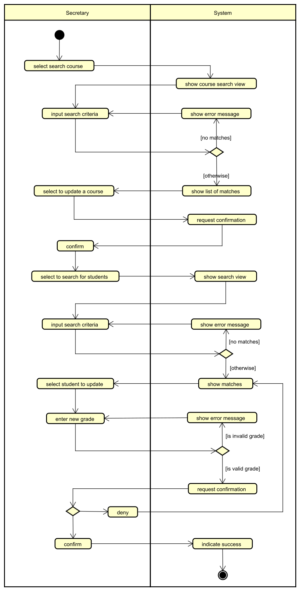

# Example

Here is a description of how to update a grade in a course. It is somewhat similar to a use case description (just the scenario), but without the user stories and other details.

1. Select to search for a course
2. Secretary searches for the course name
3. System shows matching courses
   - if no courses are found, the system shows a message and goes to step 1
   - if multiple one or more courses are found, the system shows a list of courses and asks the user to select one
4. Secretary verifies that a change is to be made
5. Secretary searches for a student in the course
   - if no student is found, the system shows a message and goes to step 5
   - if multiple one or more students are found, the system shows a list of students and asks the user to select one
7. Select student to update
8. Secretary selects to enter a new grade for the chosen student
9. Secretary enters a grade (in the 7-grading scale)
10. If the grade is illegal (not -3, 00, 02, 4, 7, 10 or 12) then an error message is shown and go to step 9 again
11. System asks secretary to confirm the grade
    - if the secretary confirms the grade, the system updates the grade and displays a success message
    - if the secretary does not confirm the grade, the system shows a message and goes to step 9 again

In this case, we have a fairly clear description of the flow, and we can more or less just make an activity for each step from the above list. Just take it from the top.

Consider reading through the first textual description, versus understanding the diagram. Which is easier?

