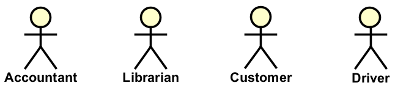

# What are actors?

In software design, an **actor** is anyone that interacts with the system. Actors typically represent human users of the system. Though, in some cases, they can also represent other systems that interact with the system.

It is important early on to identify the actors of your system, to define them, and to describe how they will interact with the system.\
This description should be a brief overview, and clarification.

Sometimes, you will discover actors, whose title may not immediately be clear to the reader. For example, if you are designing a system for a library, you may discover that the "users" of the system are not just the people who check out books, but also the librarians who manage the books.
Or, if you are designing a system for a bank, you may discover that the "users" of the system are customers, administrators, tellers, and other staff. 

Putting names to these actors will help us distinguish between them, and to understand how they will interact with the system.

Generally, different actors will have different needs, and different ways of interacting with the system.

## Types of actors

Actors can also be called "users" of the system. We have several different types. But first, we must name the actor.

### Naming the actor

Because actors are users of the system, students will often just call all actors "users". But, please! do take an extra second, and think about a better name for the actor. "User" is so generic, it hardly tells us anything about the actor. So, for example, instead of calling an actor "user", call them "student", "teacher", "librarian", "customer", "administrator", "support staff", etc.

The name for the actor comes from the domain of the system.

### Human actors

In most of your systems, the primary actor will be human.

- **Users** - People who directly use the application. These are by far the most common actors.

But we might have other actors, who may not be direct users, but who will interact with the system.

- **Administrators** - People who manage and maintain the system
- **Support staff** - People who help users with the system

### System actors

Not all _entities_, who use the system, are human.

**Other applications** - External software systems that communicate with your system

### Environmental actors

Sometimes you system reacts to events from outside the system. Given that these events can cause our system to behave in a certain way, we can consider them to be actors. Examples:

- **Time** - Scheduled tasks, time-based events, or automated processes. I.e. at certain times, the system will automatically do something.
- **Hardware** - Sensors, devices, or physical components. I.e. the system is connected to a physical device, and the device will trigger an event in the system.
- **External events** - System triggers from outside sources. I.e. the system is connected to a external system, and the external system will trigger an event in the system. This is essentially the as the above "other applications".

## Why actors matter

Actors help us understand:
- **Who** will use our system
- **What** they need from it
- **How** they will interact with it
- **When** interactions will occur

Many systems will have different types of primary actors. It is important to distinguish between them, because often, different actors will have different needs, different ways of interacting with the system, and have different roles and privileges.

## UML

In UML, actors are reprented as a stickman figure, with a name below.

## Which diagrams?

Generally, actors will be shown in 
- use case diagrams
- sequence diagrams
- System sequence diagrams