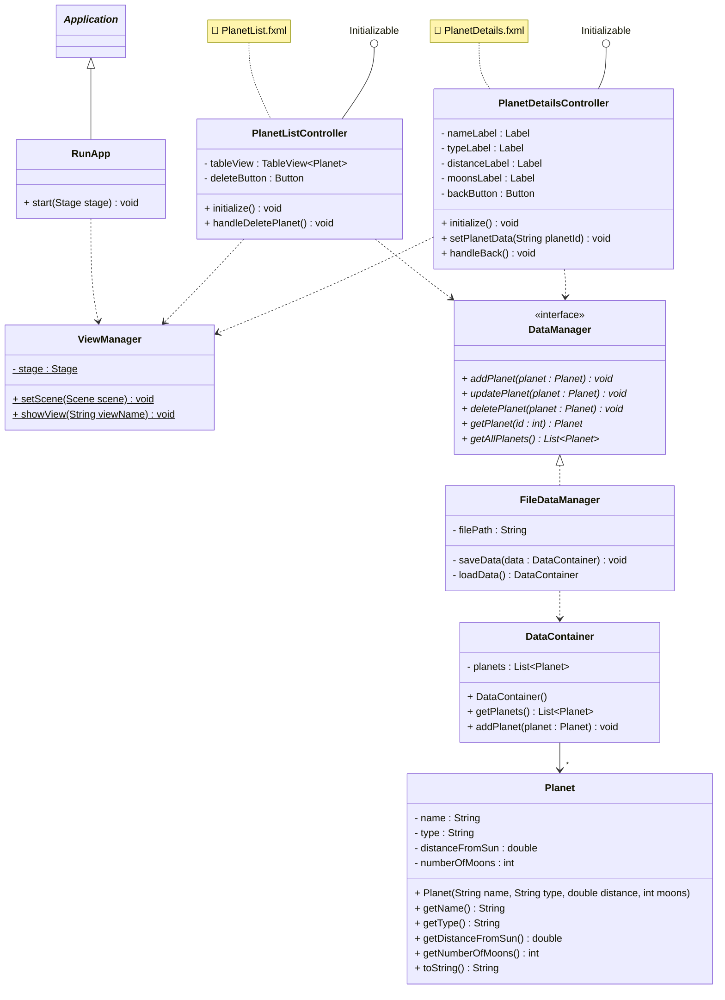

# Example: Planet Explorer System

Here's an example class diagram for (part of) a simple planet explorer system. Class diagrams tend to grow quite large, so I will not show the entire diagram.

```mermaid
classDiagram
    class RunApp {
        + start(Stage stage) void
    }

    class ViewManager {
        - stage : Stage$
        + setScene(Scene scene) void$
        + showView(String viewName) void$
    }

    class PlanetListController {
        - tableView : TableView~Planet~
        - deleteButton : Button
        + initialize() void
        + handleDeletePlanet() void
    }
    note for PlanetListController "📄 PlanetList.fxml"

    class PlanetDetailsController {
        - nameLabel : Label
        - typeLabel : Label
        - distanceLabel : Label
        - moonsLabel : Label
        - backButton : Button
        + initialize() void
        + setPlanetData(String planetId) void
        + handleBack() void
    }
    note for PlanetDetailsController "📄 PlanetDetails.fxml"

    class DataManager {
        <<interface>>
        + addPlanet(planet : Planet)* void
        + updatePlanet(planet : Planet)* void
        + deletePlanet(planet : Planet)* void
        + getPlanet(id : int)* Planet
        + getAllPlanets()* List~Planet~
    }

    class FileDataManager {
        - filePath : String
        - saveData(data : DataContainer) void
        - loadData() DataContainer
    }

    class DataContainer {
        - planets : List~Planet~
        + DataContainer()
        + getPlanets() List~Planet~
        + addPlanet(planet : Planet) void
    }

    class Planet {
        - name : String
        - type : String
        - distanceFromSun : double
        - numberOfMoons : int
        + Planet(String name, String type, double distance, int moons)
        + getName() String
        + getType() String
        + getDistanceFromSun() double
        + getNumberOfMoons() int
        + toString() String
    }

    _Application_ <|-- RunApp
    RunApp ..> ViewManager
    Initializable ()-- PlanetListController
    Initializable ()-- PlanetDetailsController
    PlanetListController ..> ViewManager
    PlanetDetailsController ..> ViewManager
    PlanetListController ..> DataManager
    PlanetDetailsController ..> DataManager
    DataManager <|.. FileDataManager
    FileDataManager ..> DataContainer
    DataContainer --> "*" Planet
```