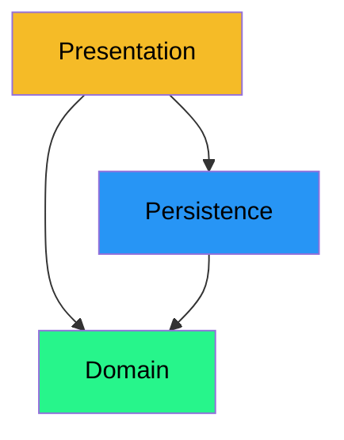

# Best practices for class diagrams

I have a few suggestions for you, to help you create a good class diagram. This includes good layout and structure, making things more readable. Eventually, I will probably expand this page with image examples.

- Use the angled lines to connect the classes. I.e. lines are vertical or horizontal, with 90 degree angles. Only in very certain cases, will the straight line make sense.
- Color code your elements, I have my own color scheme, but you can use whatever you want.
  - Class are white
  - Interfaces are yellow
  - Enums are green
  - Packages are blue, with a change in hue for each nesting-level
- minimize crossing lines. Often you can move some classes around, to avoid crossing lines.
- Interfaces are drawn above the classes that implement them.
- Abstract classes are drawn above the classes that extend them.
- Super-classes are drawn above the subclasses.
- The layered architecture, i.e. persistence, presentation, should be drawn as packages on top of each other. The UI goes on the top, the persistence layer below. The domain is usually to the side of the two layers.

Your packages should have a similar layout in Astah.