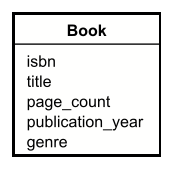
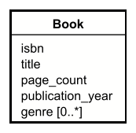
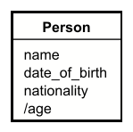

# Attributes

Attributes are the properties of an entity. They are the data that the entity has. For example: 

- `Book` has attributes like `title`, `author`, `publication year`, and `genre`.
- `Author` has attributes like `name`, `nationality`, and `date of birth`.
- `Member` has attributes like `name`, `email`, `phone`, and `membership status`.
- `Loan` has attributes like `loan date`, `due date`, and `return date`.
- `Event` has attributes like `date`, `time`, and `location`.
- `Room` has attributes like `room number`, `capacity`, and `location`.

These attributes are also nouns, so there is a task in figuring out if a noun is an attribute or an entity, or should be ignored.

## UML

In UML, attributes are written in the bottom compartment of the entity box.

Example:

You may notice the difference from class diagrams: no access modifiers, no type. These do not make sense in a domain model, they are implementation details.

## Multivalued attributes

Sometimes an attribute has many values. For example:

- An Employee has several phone numbers
- A Toy has several colors
- A Book has several genres

In UML, this is represented by adding multiplicity to the attribute. There are several options, for example:

- `[0..*]` means zero or more, i.e. there can be zero
- `[1..*]` means one or more, i.e. at least one
- `[0..3]` means zero to three

And so, if we update the book's genre attribute to be multivalued, it would look like this:

## Derived attributes

These are attributes, which are calculated based on other attributes. For example:

- The age of a person is the current year minus the year of birth.
- The price of a book is the base price plus the tax.
- The due date of a loan is the loan date plus the loan period.
- The total price of a order is the sum of the prices of the items in the order.
- The total weight of a package is the sum of the weights of the items in the package.
- The total volume of a box is the width * height * depth.

So, if we make a Person entity, with the attributes name, date of birth, and nationality, we can add the derived attribute age. Even though the information is implicitly there, it may sometimes make sense to add it as an attribute, explicitly. 

Derived attributes are pre-fixed with a `/` in UML, here is a Person:

