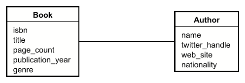
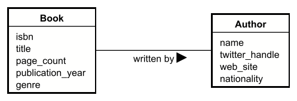
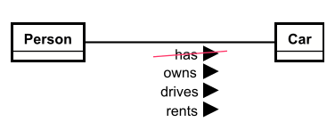

# Relationships

In any kind of problem domain with multiple entities, there are relationships between the entities. They indicate how the entities are connected to each other.

Example:

- A `Book` is written by an `Author`.
- A `Member` can borrow many `Book`s.
- A `Book` can be borrowed by many `Member`s.
- A `Member` can make many `Reservation`s on `Book`s.
- A `Book` can be reserved by many `Member`s.
- A `Member` can attend many `Event`s.
- A `Event` can be attended by many `Member`s.
- A `Member` can make many `Room Booking`s on `Room`s.
- A `Room` can be booked by many `Member`s.
- A `Member` can make many `Loan`s on `Book`s.
- A `Book` can be loaned to many `Member`s.

See how each sentence includes two entities, and some kind of connection between them.

We draw these relationships in the domain model, by drawing a line between the two entities. This line has _no_ arrowhead.

## UML relationship line

This is the line, plain and simple. 

> There are no arrows on the relationship line! None.

## Relationship name and reading direction

Look again at the list above, and notice that each relationship has some kind of description, a name. There is also a direction, i.e. the relationship goes from the first entity to the second entity.\
And each direction can _always_ be reversed:

- A `Book` is written by an `Author`.
- An `Author` writes many `Book`s.

For the name and reading direction, you must just pick one of the two options.

## UML name and reading direction

This is what it looks like in UML with a name on it:

The arrow clearly indicates the reading direction. In the above case is indicates "book is written by author".

## Be diligent with the names

To often, it is easy to just plop on one of several _generic_ names: has, is, ... probably more. These are rarely good names. Consider how the customer talks about the relationship.

A book has an author, sure, but it can be clearer, there are several potential meanings:

- The book is written by the author.
- The book is co-authored by the author.
- The book is edited by the author.
- The book is reviewed by the author.
- The book is published by the author.
- The book is illustrated by the author.
- The book is narrated by the author.
- The book has a foreword by the author.

Which one is it? 

