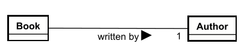
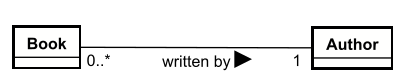
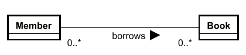

# Multiplicities on relationships

Now, let's just revisit some of the "domain senteces" again: 
- A `Book` is written by an `Author`.
- A `Member` can borrow many `Book`s.
- A `Book` can be borrowed by many `Member`s.
- A `Member` can make many `Reservation`s on `Book`s.
- A `Book` can be reserved by many `Member`s.
- A `Member` can attend many `Event`s.
- A `Event` can be attended by many `Member`s.
- A `Member` can make many `Room Booking`s on `Room`s.
- A `Room` can be booked by many `Member`s.
- A `Member` can make many `Loan`s on `Book`s.
- A `Book` can be loaned to many `Member`s.

Notice that in each of these sentences, there is a quantity. And this quantity is the multiplicity of the relationship.

A multiplicity consists of an upper and lower cardinality, separated by `..`. The upper cardinality is the maximum number of instances of the entity that can be related to the other entity. The lower cardinality is the minimum number of instances of the entity that must be related to the other entity.

To express multiplicity, we have a few options, you have seen before:

- `0..1` means zero or one.
- `1` means exactly one. Or, to be _super_ clear, you can do `1..1`.
- `0..*` means zero or more.
- `1..*` means one or more.

You can express more precise cardinalities than just "many", but _generally_ that is not necessary.

The multiplicity is at the "referenced" end of the relationship line.

## Both ends!

Remember again, that the explanation can be written from both perspectives:

- A `Book` is written by an `Author`.
- An `Author` writes many `Book`s.

So, there must be multiplicity at both ends of the relationship line.

## Examples

Let's look at some examples.

### Book and Author

1) A `Book` is written by an `Author`.
2. An `Author` writes many `Book`s.

Let's first do the first one. This is from the Book (the entity _referencing_) point of view, meaning the multiplicity mentioned is close to the Author, the entity being _referenced_.

This says "A book is written by exactly one author".

Let's do the second one. Now it's from the Author point of view. So the multiplicity from this POV is at the Book entity, the entity being _referenced_.

Now, is the lower cardinality of "0" the right one? Can an author write no books? Maybe.. depends on the context. Maybe this should be "1..*".

### Member and Book

1. A `Member` can borrow many `Book`s.
2. A `Book` can be borrowed by many `Member`s.

Now, I will just plot in both sides in the diagram. But what should it be? We have the "many" quantity in both sentences. So in each case, the upper cardinality must be "*".\
What about the lower?\
A book could be unpopular and be borrowed by no one, i.e. zero.\
And a member could have a library card, but not borrow any books, i.e. zero.

Why can a book be borrowed by more than one member? It's a physical object, only one Member can have it. _At a time_. That's important, we generally consider _time_. Not a _single point_ in time, but the history. Generally. But again, that depends on the context, and what you actually need to model.\
In this case, we assume we have some kind of borrow history, so we can track, for example, popularity of books and see if we need to buy more copies.

ww

### Generalizing

Often at least one of the multiplicities is clear from your analysis. But sometimes, the other end may not be. Either you go back to the customer and ask for more information, or you make a reasonable guess. Maybe you know something about this particular problem domain, and can reason about it.

