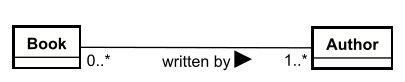
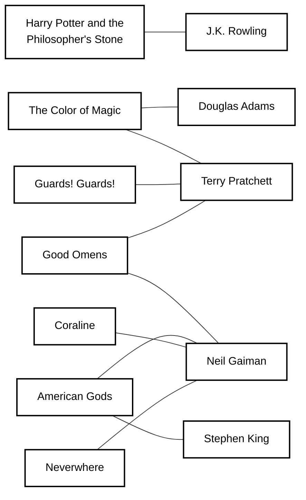
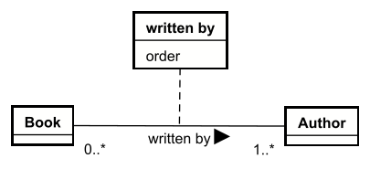

# Relationship attributes

Let's revisit the relationship between `Book` and `Author`. But we rework it a little bit, now a Book can have multiple authors:

This is not uncommon. Sometimes several authors work together. Sometimes the person writing the foreword or a single chapter is also credited as an author.\
In these cases, the authors are listed in order of contribution. The author who did the most work is listed first. 

This particular book is written by two authors: Terry Pratchett and Neil Gaiman.

Now, how do we express the ordering of the authors in the domain model? I want Terry Pratchett to be listed first, and Neil Gaiman to be listed second.

Observe below, how each author can write more than one book, and each book can have multiple authors. For each of these connections, we want specific information: "For this particular book, what is the order of this particular author?"

Could I make a multivalued attribute in the Book? Listing both authors in that attribute? No, that will not work. We would be implying the relationship to Author in multiple ways, both the attributes and the relationship line. That's not a good approach. And on second semester, when you encounter databases, you will get a deeper understanding of why this is not a good approach.\
Can I somehow add an attribute to the Author? "Ordering", perhaps? No, that will not work. Any Author could contribute to many books, and their ordering would be different for each book.

So, when we have a many-to-many relationship, like above, if we need certain data _for each pairing_ of the two entities, we need to add a relationship attribute.

For each book-and-author pairing, we need to (potentially) express the ordering of the authors. 

For this we use a relationship attribute.

It is a new box, attached to the relationship line with a dotted line. This box will contain the attributes.

Here is how we solve the problem of expressing the ordering of the authors for each book:

> Relationship attributes are _only_ relevant for many-to-many relationships! ***ONLY!!***

You do not need them for one-to-one or one-to-many relationships.

# **PAY ATTENTION!!**

> This is very important!

The relationship attribute box **IS NOT AN ENTITY!!**

> It is not!

Dude, don't do it!

You _cannot_ make a relationship from the relationship attribute box to an entity!

> You cannot!

I will not put in a picture of this abonimation, out of fear that you may be inspired to do something so horrible, and potentially, even worse! show your foul creation to me. I would be forced to destroy it, with fire.

> May the gods have mercy on your soul, should you decide to even try.