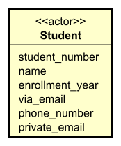

# Actor entities

Sometimes, an actor has data in the system, something to represent them. Some kind of account. 

As a Student, you have an account in VIA's system, you log in, identify yourself, and then that account is associated with _data_.
- Which class you are part of
- Which courses you are enrolled in
- Which assignments you have submitted
- Which exams you have taken
- Which grades you have received
- Which feedback you have received
- Which notifications you have received
- Which messages you have sent
- Which messages you have received
- Which messages you have received
- Etc.

We would then have an entity called `Student`, with relationships to other entities, like `Class`, `Course`, `Assignment`, `Exam`, etc.

But that Student is also an actor of the system.

We can show that, by adding a _stereotype_ to the entity.

