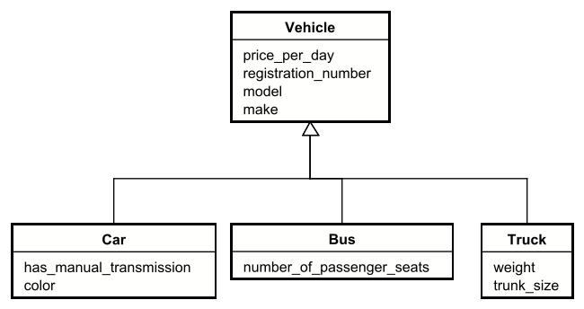
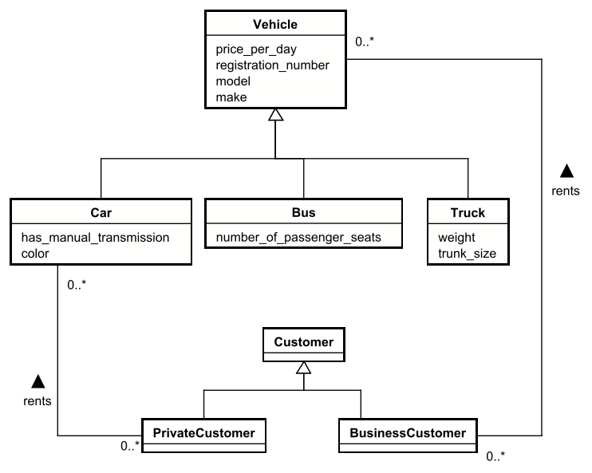

# Inheritance

This concept is also valid in domain models. It works as you are used to. You can have a `Student` entity, which inherits from a `Person` entity. Then, `Employee` also inherits from `Person`.

- You use the same UML arrow. 
- Every attribute in the parent entity is automatically inherited by the child entity.
- Every relationship to the parent entity is automatically inherited by the child entity.

We do not mark anything "abstract", that is not a concept in domain models.

Now, there may be relationships to the Vehicle entity, and there may also be relationships to any of the child entities.

The relationship to the Vehicle entity is a "general" relationship, and is also valid for the child entities.

But if the Car has a relationship to some other entity, Bus and Truck do not have that relationship.

Let's assume customers are in two categories: Private and Business. The private customers can rent Cars, while the business customers can rent all vehicles.\
We will express that like so:

