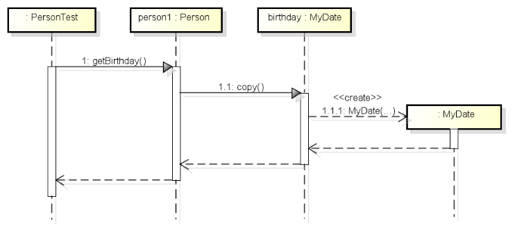

# Introduction to sequence diagrams

This type of diagram is a _dynamic diagram_. It is a diagram that shows a flow through the system _over time_. It is a _temporal_ representation of the system.

It is a _design artefact_, a way to represent the behaviour of the system..

I basically shows that 
- user clicks button
- that activates a method in the controller
- that calls another method in the data manager
- that updates the DataContainer object
- that saves the DataContainer object to the file
- that returns a result
- that updates the UI

So, it is a sequence of actions, one after another. It shows _a path_ through the system. That sounds like the activity diagram? Yes, and no. The sequence diagram is more focused on the _flow_ of the _code_ of your system. So, it is very specific for your particular implementation. An activity diagram could be implemented in many different ways.

## Example

Here is an example. The yellow boxes are the classes, we have:
- PersonTest
- Person
- MyDate

Each box has a vertical line to indicate actions going in an out of the object.

Time is vertical, and you can see the actions are numbered to indicate the sequence of actions. 
- PersonTest has an instance of Person, called person1
- PersonTest calls `person1.getBirthday()`
- This method uses the birthday field variable of the Person object, and upon that MyDate object the Person class calls `copy()`
- The copy method calls the constructor on MyDate, to create a new MyDate object

So, let's dive into the details.