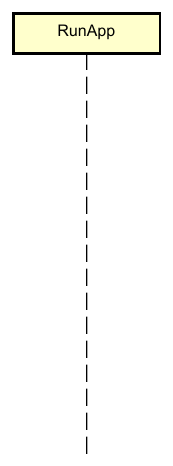
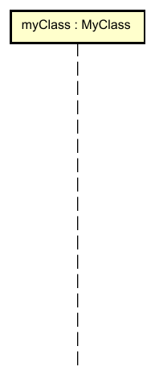

# The classes involved

The sequence diagram represents how classes and methods interact with each other.

Each class participating in the sequence diagram is represented by a box, with a vertical dashed line.

Sometimes, you wish to clarify the variable, that a method is being called on. So, we can follow the UML convention, and prefix the class with the variable name.

I find that the latter often takes up more space, than is strictly necessary. And while it is more precise, it is rarely needed. So, I usually stick to the former, showing just the class name.