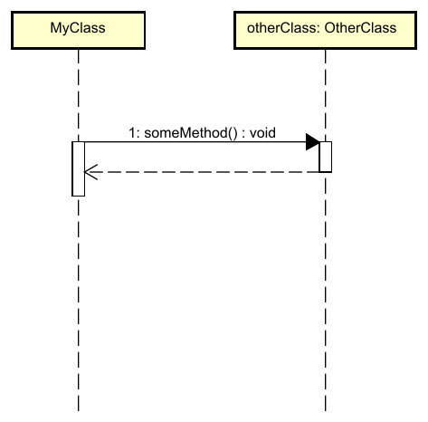

# Calling methods

In your systems, you will often call methods on objects, or classes. This is represented by an arrow, from the caller to the callee.



## Explanation

In this sequence diagram, we see two participants: **MyClass** and an **otherClass** variable of type **OtherClass**. 

- **MyClass** represents the calling class (could be a main method or any other class)
- **otherClass** is a variable of type **OtherClass**

The diagram shows a **method call** from `MyClass` to `OtherClass::someMethod()`:

1. **The solid arrow** (→) represents a method call
   - The arrow goes **from left to right**, from the caller (`MyClass`) to the callee (`OtherClass:otherClass`)
   - The label on the arrow is **"1: someMethod()"**, indicating:
     - **1** = the sequence number (this is the first interaction)
     - **someMethod()** = the name of the method being called. We see that `someMethod()` takes no parameters, and returns a `void`

2. **The dashed arrow** (⤏) represents the **return** from the method
   - The dashed arrow goes **from right to left**, from `OtherClass:otherClass` back to `MyClass`
   - This shows that the method has completed execution and control returns to the caller
   - In this case, the return value is **void** (no value returned). If a value is returned, it will be shown on the arrow.

3. **The white rectangles** on the vertical dashed lines are called **activation bars**
   - They show when a participant is "active" (executing code)
   - `MyClass` is active during the entire sequence
   - `OtherClass:otherClass` is only active while executing `someMethod()`. Notice how this vertical box is shorter than the one for `MyClass`. 


## Java Code Example

Here's how this sequence diagram translates to Java code:

```java
public class MyClass {
    public void doSomething() {
        // This is where the sequence diagram starts
        otherClass.someMethod();  // The solid arrow (method call)
        // When someMethod() returns, execution continues here (dashed arrow)
    }
}

public class OtherClass {
    public void someMethod() {
        // Code executed when someMethod() is called
        
        // Method returns here (void return, dashed arrow back to MyClass)
    }
}
```


