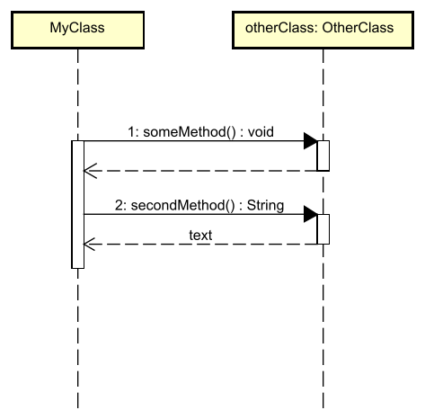

# Return values

Each method returns, at some point. Thereby the method is finished. And it either returns a value, or it returns nothing (void).

In the following example, we have two method calls, one returning a value, and one returning nothing.

The second method call returns a variable called `text`, and we can see the method's return type is of type `String`.