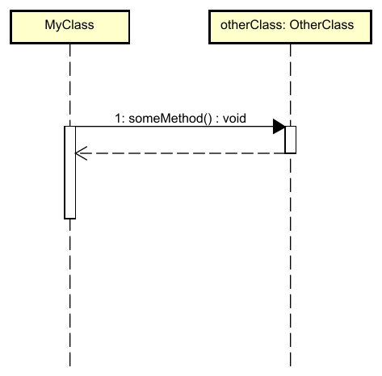
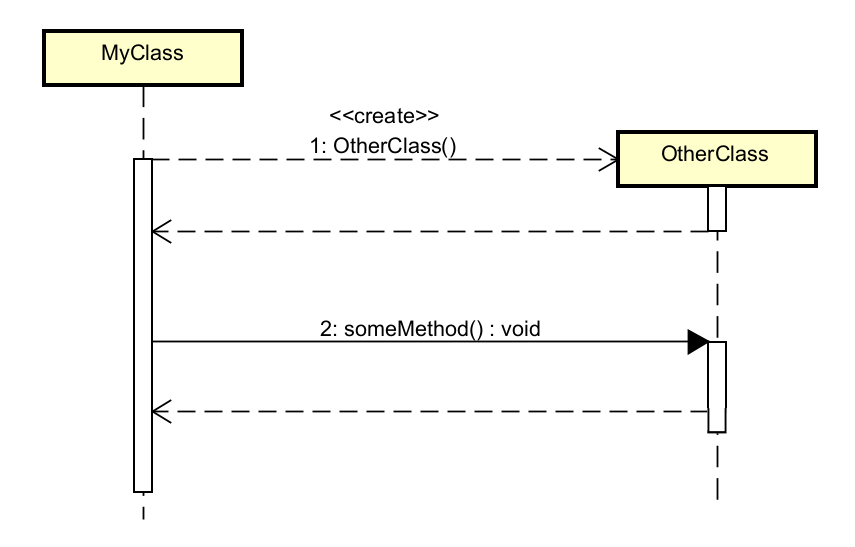

# Method lifetime

Given this is a dynamic, _temporal_ representation of the system, we also represent time. And every method called has a lifetime. The method takes _some time_ to execute.

This is represented by a vertical box on a class' dashed, vertical line.

- They show when a participant is "active" (executing code)
- `MyClass` is active during the entire sequence, it's box is the longest, spanning all other boxes (there is only one other box)
- `OtherClass:otherClass` is only active while executing `someMethod()`. Notice how this vertical box is shorter than the one for `MyClass`. 

So, this diagram shows that the first thing that happens is that `MyClass` calls `otherClass.someMethod()` (solid arrow).\
Then, `otherClass` is active, and `someMethod()` is executed (activation bar).\
Eventually, `someMethod()` is finished, and execution continues in `MyClass` (the dashed arrow).\
Finally, `MyClass` is finished, it's box runs out of time, and the sequence diagram is finished.

I can drag the boxes longer or shorter, to represent the time it takes to execute the method. This is just relative, and often not super important.

## Contraints

Astah is a diagramming tool (not just drawing boxes tool), and it also includes rules to ensure the diagram is correct. This is sometimes annoying, because you make want to abstract away some details, but Astah will not let you.

In the above case, I may want to indicate that `MyClass` is doing something _before_ calling `otherClass.someMethod()`. But Astah will not let me drag up the arrow representing the mehod call. 

I could add more bloat, i.e. details, to the diagram, to actually show what is happening before the `someMethod()` call. But this is not always relevant, and it can make the diagram more confusing.

Maybe `MyClass` is printing something out, or adding numbers together, or... And I would have to explicitly included that in the diagram. But the focus of this diagram is generally to show how classes interact, and not to show the internal details of the implementation.

## Timing

Again, this is a temporal representation of the system. So, the timing is important. The arrows represent interactions, and their position on the vertical activation bars represent _when_ the interaction happens.

I regularly see a mistake where the activation bars do not match the arrows. I can't even recreate this, because it is incorrect, and Astah will not let me.\
But, somehow my students can mess up even beyond this, and create something like the below:

Notice how the activation bar on OtherClass::someMethod extends _beyond_ the dashed return arrow. This does not make sense. When a method returns, the activation bar should end at the same time as the return arrow.

Or sometimes, the arrows are out of order, which I cannot make Astah do either. 

Just... erh... don't try so hard to mess up the diagram, ok? It seems to actually be quite difficult to do so.