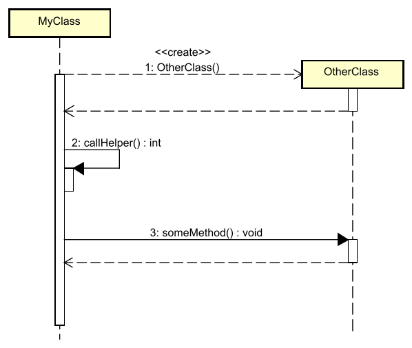

# Calling methods on self

Sometimes your class calls a method on itself, maybe a private helper method. This is shown by a solid arrow, which does a U-turn onto the method activation bar, adding a second bar to it. Yeah, sounds weird, it's hard to explain. A picture is worth a thousand words, here:



Notice how there is no explicit return arrow from the helper method. Still, we can see the return type is `int`, and the activation bar for the helper method is shorter than the one for `MyClass`.

## Java Code Example

```java
public class MyClass {
    
    public void doSomething() {
        // <<create>> - Create new instance
        OtherClass otherClass = new OtherClass();
        
        // 2: Call helper method on SELF (this)
        int result = callHelper();

        // 3: Call otherClass method
        otherClass.otherClass();
    }

        // Private helper method
    private void callHelper() {
        // Helper code executed here
        // This is called from within otherClass()
        return 42;
    }
}

public class OtherClass {
    
    // Constructor
    public OtherClass() {
        // Constructor code
    }
    
    // The main method called from MyClass
    public void someMethod() {
        // Some code here...
        // returns back to MyClass::doSomething() (dashed arrow back)
    }
}
```