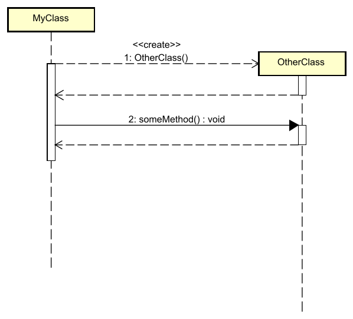

# Constructors

Sometimes, one class will instantiate another class. We represent this by a dashed "create" arrow. It looks similar to the return arrow, but it points from a method activation bar to a class box. 

This will put the class box of the instantiated class, at the same level as the method activation bar. And, remember, time is on a vertical axis, so it is clearer that this second object is created _after_ this sequence diagram has started.

Here is an example, where `MyClass` instantiates an object of type `OtherClass`.\
The constructor of `OtherClass` is executed, and returns shortly after.\
Now `MyClass` can use the `otherClass` variable to call methods on the `OtherClass` object.




Now, the `otherClass` variable is actually not show this time, the `someMethod()` points to the `OtherClass` class box, rather than an instance of `OtherClass`.

I find this is generally a fair trade off, otherwise the diagram can become crowded. I am also having difficulty getting a second `otherClass : OtherClass` box into the diagram at the correct place. It needs to be below the `OtherClass` box, and then the `someMethod()` call arrow needs to point to the `otherClass:OtherClass` box, rather than the `OtherClass` box.


This would be the code for the above diagram:

```java
public class MyClass {
    
    public void doSomething() {
        // 1: <<create>> - Create a new instance of OtherClass
        OtherClass otherClass = new OtherClass();
        // The constructor returns here (dashed arrow back)
        
        // 2: someMethod() - Call a method on the newly created object
        otherClass.someMethod();
        // Method returns (dashed arrow back)
    }
}

public class OtherClass {
    
    // The constructor
    public OtherClass() {
        // Constructor code executed here
        // Then returns (dashed arrow back to MyClass)
    }
    
    public void someMethod() {
        // Method code executed here
        // Then returns (dashed arrow back to MyClass)
    }
}
```
