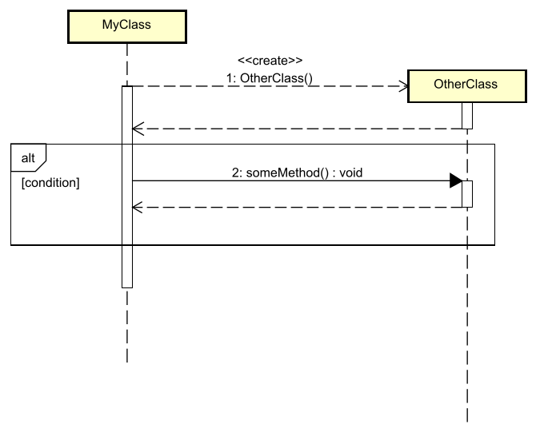
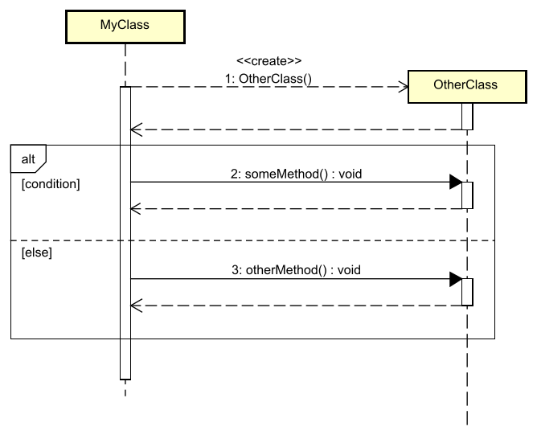

# Decisions

Or... if-statements. We can represent these in sequence diagrams. 

We _can_ represent the if-statement in the diagram, by showing both possible paths.

> I don't like this

I recommend your diagram shows a single path, generally the main sequence, the happy path, from your Use Case Description. Then, you can add other diagrams showing the alternative paths.\
If you mix both together, it too often becomes crowded and confusing.

But, here is the notation. 

## If

The decision is represented by a box, and everything in the box is conditionally executed.



The "alt" box shows that this particular path is only happening if the `[condition]` (i.e. the "guard") is true. 

Example code:

```java
public class MyClass {
    public void myMethod() { // not explicitly shown in diagram
        // The <<create>> interaction
        OtherClass otherClass = new OtherClass();

        // The alt
        if (condition) {
            otherClass.someMethod();
        }
    }
}
```

## If-else

We can add else parts too, by adding a second box representing the else path.



Notice the second compartment, with the `[else]` guard.

You can of course add more sub-boxes, if you need if-elseif-else.

## Coloring

I think the previous diagram is already cluttered, with the if-else box. We are just adding more black lines, and it becomes harder to read.

I would have liked to color the boxes, to make it stand out more, and to separate the "if-box" from the actual code-execution-representation.

Astah cannot do this. Or, at least, I cannot make it work.

I would have liked something like this:


And that was tedious to draw, and not super beautiful. Anyway...