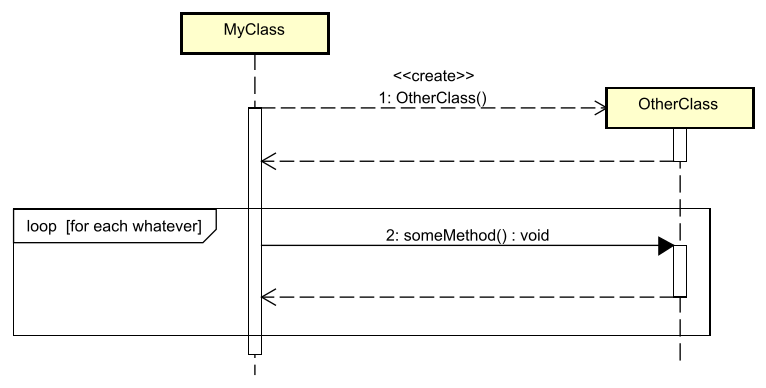

# Loops

We can represent loops in sequence diagrams. They look similar to the decision boxes. Just labeled "loop" instead of "alt".

It's the same type of box:



here, `MyClass` calls `otherClass.someMethod()` a number of times. You put the explanation of the loop in the guard, i.e. the `[   ]` part. E.g. "repeat this until the condition is false".

## Example code

Here is a diagram with a loop, and the code that matches it:


## Java Code Example

Here is the code that matches the diagram, notice many parts are left out, for brevity.

```java
public class GradeListTest {
    
    public void testTheList() {
        // 1: toString() - This method contains the loop
        String result = list.toString();
        // Method returns (dashed arrow back)
    }
}

public class GradeList {
    
    private Grade[] grades;
    
    public String toString() {
        String result = "";
        
        // [for all grades in list] - The loop starts here
        for (int i = 0; i < grades.length; i++) {
            // 1.1: getGrade() - Call getGrade() on each Grade object
            int grade = getGrade(i);
            // Method returns (dashed arrow back)
            
            // 1.2: toString() - Call toString() on the Grade object
            result += grade.toString() + " ";
        }
        // Loop ends, return to caller (dashed arrow back to GradeListTest)
        
        return result;
    }

    private Grade getGrade(int index) {
        return grades[index];
    }
}

public class Grade {
    public String toString() {
        return "Grade: " + grade;
    }
}
```

