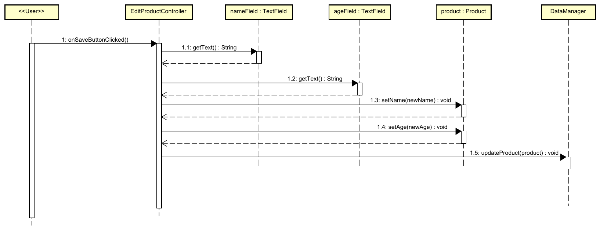

# Actors

Sometimes, a specific sequence is initiated by some user pressing a button. Or, some other user-initiated action.

It would have been nice, if we could add a stick-man-figure to the diagram, to represent the user. But, we can't.

I suggest just making a class representing the user, and call it "User". Or, "Customer", "Student", "Librarian", "Administrator", etc.

It could look like this, notice the left-most class, which is called `<<User>>`.

