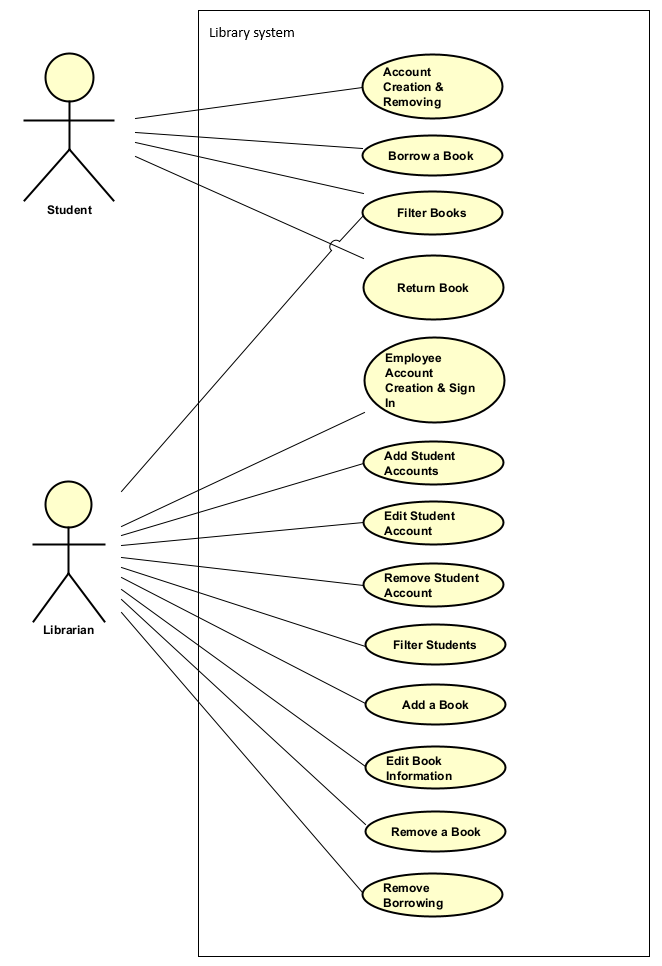
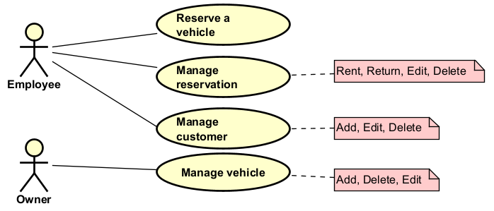

# Introducing use case diagrams

The _use case diagram_ is an analysis artefact, a UML diagram, that provides an overview of actors in the system, and the actions they can perform.

It is a visual representation of the requirements, with less details. The purpose is to provide a high-level overview of what each user type does in the system.

This "high-level" is achieved by grouping related user stories together into _use cases_. These are represented by bubbles in the diagram. We will explain them in detail on upcoming pages.

The diagram should be accompanied by a table showing which user stories are included in which use cases. This is to make sure every user story is covered.

Consider the following examples:

Here is one for a library system.

And here is one for a car rental system.

