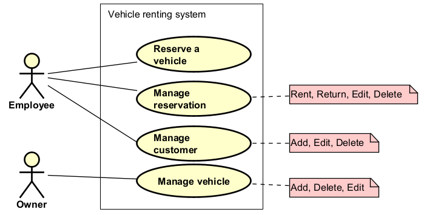

# Introducing use case diagrams

This learning path will introduce you to use case diagrams, and how to create them.

## What is a use case?

This is explained in more detail in the "Use case descriptions" learning path. But for a quick recap:

We can say a "use case" is a detailed description of some functionality in the system, that the actor can perform. A single use case can include multiple user stories, descriptions, and diagrams.\
A use case is a collection of related success and failure _scenarios_ that describe an actor using a system to support a goal.

These use cases can then be represented in a _use case diagram_, with the purpose of providing a high-level overview of the system.

## Then, what is the use case diagram?

The _use case diagram_ is an analysis artefact, a UML diagram, that provides an overview of actors in the system, and the actions they can perform, i.e. the use cases.

It is a visual representation of the use cases, with less details. The purpose is to provide a high-level overview of what each user type does in the system.

This "high-level" is achieved by just providing titles, and potentially grouping related use cases together to simplify the overview. 

The diagram should be accompanied by a table showing which user stories are included in which use cases. This is to make sure every user story is covered.

Consider the below examples.

Here is one for a library system.

It should be clear that a `Student` can borrow a book, return a book, etc. While the `Librarian` can manage student accounts, add new books to the library, etc.

And here is a small one for a car rental system.

