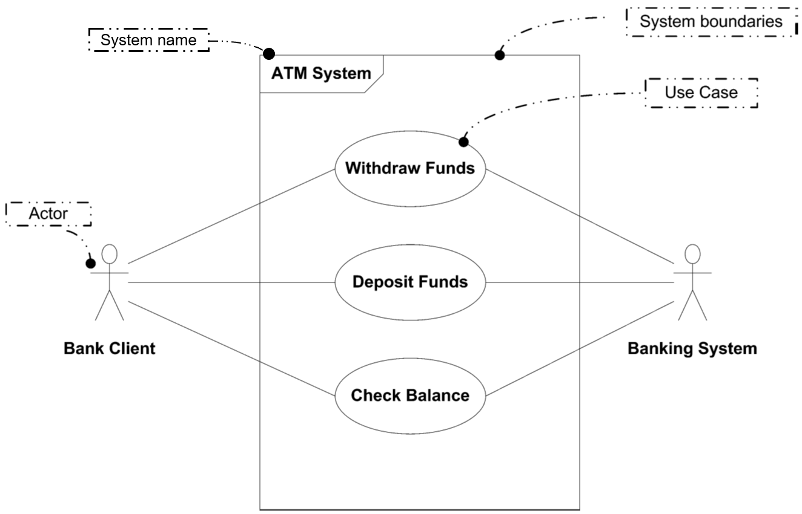

# The structure of the use case diagram

The use case diagram has a specific structure, or layout.

1) Primary actors are on the left. These are the actors which _interacts with the system_.
2) Use cases are in the middle. These are the actions that the actors can perform, or the goals they want to achieve. They are encased in a box, representing the system. 
3) Supporting actors are on the right. These are the actors which the system uses. They are rare for your projects.
4) A box around the use case bubbles, with the name of the system.

Here is a third example, about an ATM system, with a few extra notes:

Notice the "Banking System" supporting actor on the right. That's because the ATM system uses the banking system to get the account information.