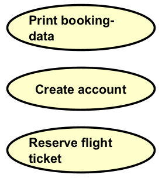

# The use case bubbles

In the use case diagram, use cases are represented as oval bubbles, with a title inside.

It is a piece of functionality in the system, that the actor can perform.

## Format

There is a general format, which will fit for most use case titles:

> [Verb] [Object]

- Create Product
- Record Match Result
- Add Product to Cart
- Checkout Cart
- Analyze time paradox

## Where do they come from?

The use cases shown in the diagram first come from the use cases you have identified. For each use case, you put a bubble in the diagram, with the title of the use case.

You will probably often find that each user story maps to a single use case. Though, there are cases, where this is not true.

Here's an example of how user stories map to use case titles in a library system. Notice how multiple user stories about searching for a book are merged into a single use case, "Search Book".

| User Story | Use Case Title |
|------------|----------------|
| As a _librarian_, I want to be able to _add a new book to the library_, so that I can _be able to loan out books_. | Add Book |
| As a _librarian_, I want to be able to _search for a book by title_, so that I can _find a book quickly_. | Search Book |
| As a _librarian_, I want to be able to _search for a book by author_, so that I can _find a book quickly_. | Search Book |
| As a _librarian_, I want to be able to _search for a book by ISBN_, so that I can _find a book quickly_. | Search Book |
| As a _librarian_, I want to be able to _mark a book as loaned out_, so that I can _keep track of unavailable books_. | Mark Book as Loaned |
| As a _librarian_, I want to be able to _mark a book as returned_, so that I can _keep track of available books_. | Mark Book as Returned |
| As a _student_, I want to be able to _create an account_, so that I can _borrow books from the library_. | Create Account |
| As a _student_, I want to be able to _browse available books_, so that I can _find books I'm interested in reading_. | Browse Books |
| As a _student_, I want to be able to _reserve a book_, so that I can _ensure it's available when I come to pick it up_. | Reserve Book |
| As a _librarian_, I want to be able to _generate overdue reports_, so that I can _contact students with late returns_. | Generate Overdue Report |
| As a _librarian_, I want to be able to _remove a book from the system_, so that I can _maintain an accurate inventory_. | Remove Book |
| As a _student_, I want to be able to _view my borrowing history_, so that I can _remember which books I've read_. | View Borrowing History |
| As a _administrator_, I want to be able to _manage librarian accounts_, so that I can _control system access_. | Manage Librarian Accounts |

Notice how the use case titles extract the core action from the user story, following the **[Verb] [Object]** format.

