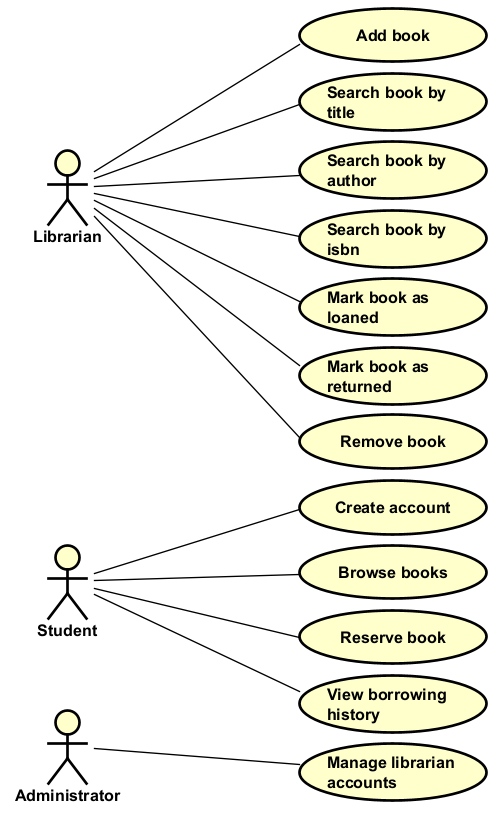

# Building the diagram

You can use Astah to build the diagram. Or you can use [draw.io](https://app.diagrams.net/).

- **Astah** is a diagramming tool with many dedicated features for UML. It is not great for real time collaboration. There might be a plugin, but I have not explored it.
- **draw.io** is a free, online, diagramming tool. It is more raw drawing, than Astah, and is therefore less restrictive, but perhaps also a bit more finicky. The file can be saved to google drive, and shared among collaborators. I am like 87% sure it supports real time collaboration.

From the previous page, we have the following use case titles:

- (Librarian) Add Book
- (Librarian) Search Book
- (Librarian) Mark Book as Loaned
- (Librarian) Mark Book as Returned
- (Student) Create Account
- (Student) Browse Books
- (Student) Reserve Book
- (Librarian) Generate Overdue Report
- (Librarian) Remove Book
- (Student) View Borrowing History
- (Administrator) Manage Librarian Accounts

## Step 1

Go through your use cases, one by one, and convert them to use case bubbles. Plop these bubbles in the middle of the diagram.

You should really aim to keep (most of) the bubbles in a vertical allignement, as you have seen in previous examples.

## Step 2

Add the primary actors to the left of the diagram. Again, they are stacked vertically. Don't mess with convention, unless you have a _really_ good reason. Which you don't. 

In this case we have three actors: Librarian, Student, and Administrator. The ordering of the actors is not strictly important, but on a later page I discuss inheritance, where you may want to put the general actor above the specific ones.

## Step 3

Add the relationships between the actors and the use cases, i.e. who can do what. We do this by drawing a _straight_, full drawn line from the actor to the use case. Try to organize actors and use cases in a way which minimizes the number of crossing lines. This will improve readability.

Note that sometimes, multiple actors can use the same use case. Then you just draw a line from each actor to the use case.

## Step 4

Add the supporting actors to the right of the diagram, if you have any. Again, they are stacked vertically. On the right hand side.\
Draw lines from use cases to the secondary actors, as needed.