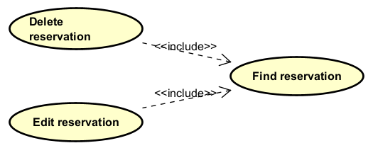

## Include relationship

One use case can **include** another use case. 

It is common to have some _partial behavior_ that is common across several use cases.
For example, the description of paying by credit may occur in several use cases, including Process Sale, Process Rental, Contribute to Lay-away Plan, and so forth.

Consider the following example:

This means that if the user wants to "delete a reservation", or "edit a reservation", they **_must_** first find it. You **_cannot_** delete/edit a reservation, without first finding it.

# Examples

