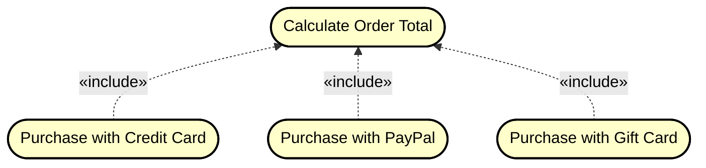

## Include relationship

One use case can **include** another use case. 

It is common to have some _partial behavior_ that is common across several use cases.
For example, the description of paying by credit card may occur in several use cases, including Process Sale, Process Rental, and so forth.

Consider the following example:

This means that if the user wants to "delete a reservation", or "edit a reservation", they **_must_** first find it. You **_cannot_** delete/edit a reservation, without first finding it.

## When to Use Include

Use include when:
- Multiple use cases share **common functionality**
- You want to avoid **duplicating** behavior across use cases
- The included use case is **mandatory** for the base use case to complete
- You want to **reuse** a piece of functionality across different use cases

Consider the below examples, and I am sorry for making the use cases pill-shaped rather than ovals.

## Example 1: User Authentication

Consider the following example:
- We have multiple use cases that require user authentication: "View Account Balance", "Transfer Money", "Pay Bills"
- Instead of describing authentication in each use case, we create a separate "Authenticate User" use case
- All three use cases **include** "Authenticate User" because you cannot perform these actions without being authenticated

**Diagram:**

## Example 2: E-Commerce Checkout

- Base use cases: "Purchase with Credit Card", "Purchase with PayPal", "Purchase with Gift Card"
- Included use case: "Calculate Order Total"
- All payment methods must include calculating the order total (items + tax + shipping)

**Diagram:**

## Example 3: Document Management

- Base use cases: "Print Document", "Email Document", "Export Document"
- Included use case: "Validate Document Format"
- All document operations must include validating that the document is in the correct format

**Diagram:**

## Example 4: Library System

- Base use case: "Borrow Book"
- Included use cases: "Verify Member Status" and "Check Book Availability"
- Borrowing a book requires both verifying the member is in good standing and checking if the book is available

**Diagram:**

