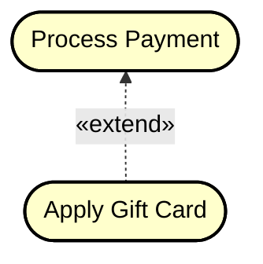
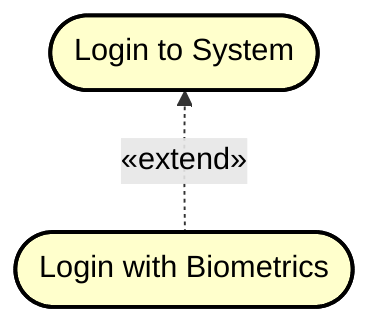
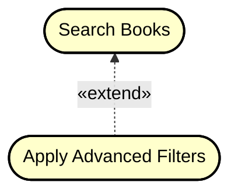
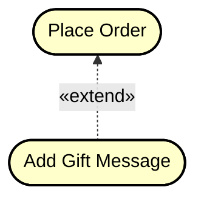
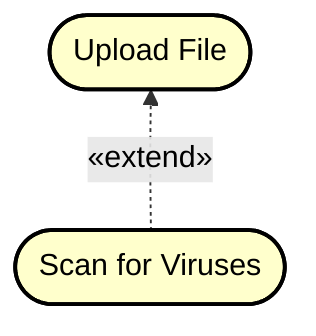

# Extend relationship

One use case can **extend** another use case, or worded slightly better: add an extension to another use case. This is a way to add new/extra/alternative behavior to a use case, without modifying the original use case.

There are several cases:

- This could happen if use case A is finalized, and we do not want to (or cannot) fiddle with it anymore.\
But then, later, we may discover new functionality, which is related to use case A. Instead of modifying use case A, we can create use case B.
- The new addition is too complex to add to use case A, and it would be better to keep use case A simple.
- The extended behaviour is optional.
- The extended behaviour is reusable across multiple use cases.

I don't see how this will be relevant for any of your semester projects.

Instead, I will generally recommend just modifying the original use case, and adding the new behavior.

But, consider the below examples, and **I am sorry for making the use cases pill-shaped rather the ovals**. I will eventually update this.

## Example 1: Payment Processing

Consider the following example:
- We have the main use case "Process Payment" that handles standard credit card payments.
- We later add an extension "Apply Gift Card" to allow users to divert from the original payment path by applying a gift card.
- The gift card option is optional and extends the payment process without changing the core payment functionality.

**Diagram:**

## Example 2: User Login

- Base use case: "Login to System" handles standard username/password authentication.
- Extension: "Login with Biometrics" extends the login process to support fingerprint or face recognition.
- The biometric option is an alternative that extends the standard login without modifying it.

**Diagram:**

## Example 3: Book Search

- Base use case: "Search Books" allows basic search by title.
- Extension: "Apply Advanced Filters" extends the search to include filters for genre, publication year, rating, etc.
- Advanced filtering is optional functionality that extends the basic search.

**Diagram:**

## Example 4: Order Processing

- Base use case: "Place Order" handles the standard order submission.
- Extension: "Add Gift Message" allows customers to include a personalized message with their order.
- The gift message is optional and extends the order placement without modifying core order logic.

**Diagram:**

## Example 5: File Upload

- Base use case: "Upload File" handles standard file uploads.
- Extension: "Scan for Viruses" extends the upload process to include an optional security scan.
- Virus scanning is an enhancement that can be added without changing the base upload functionality.

**Diagram:**

## When to Use Extend

Use extend when:
- The new functionality is **optional** or **conditional**
- You want to add behavior without modifying the original use case
- The extension represents an alternative or exceptional flow
- The base use case can complete successfully without the extension

