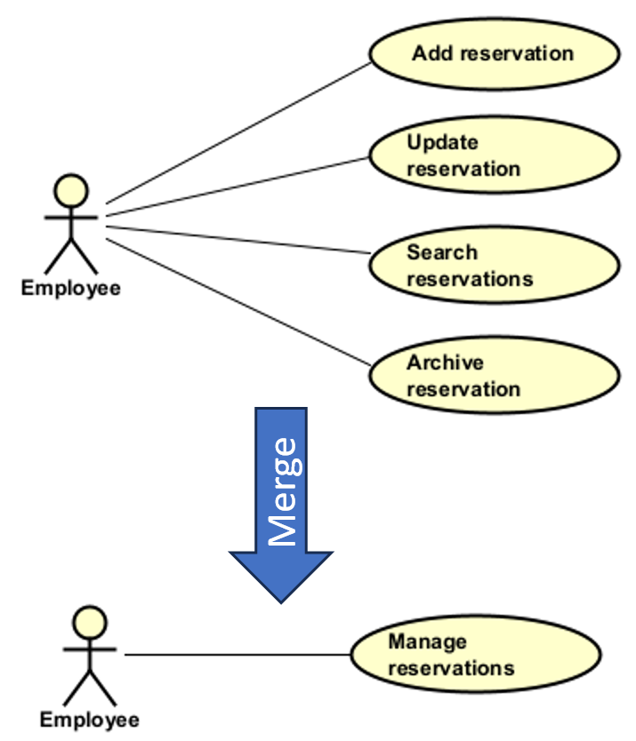

# Merging bubbles

I started out by explaining that the purpose of the use case diagram is to provide a high-level overview of the system.\
Then I recommended that you convert each user story into a bubble.

This is a good start, but sometimes, you will want to merge two or more bubbles into one. Why?

- It makes the diagram more readable.
- Several user stories are related and can be combined into one use case.
- You have so many user stories, that the diagram becomes incomprehensible, neglecting its original purpose.
- Several user stories together form a full use case. I.e. each user story is one or more steps in the use case.

## Example: Merging Create, View, Update, Delete

You will often have user stories that are related to creating, viewing, updating, and deleting a resource.

Generally, you can then merge these bubbles into one, called something like "Manage [Resource]".

**Example:**

## Examples

Below I provide various examples of merging bubbles. Some are grouping related features. Others are grouping sequential steps into one use case.

### Example: merging pieces of a use case into one use case

Consider the below user stories

1. As a shopper, I want to review my cart and totals so I can confirm what I’m buying.
2. As a shopper, I want to add/select a delivery address so I can receive the order.
3. As a shopper, I want to choose a shipping option so I can balance speed and price.
4. As a shopper, I want to enter card/MobilePay/PayPal so I can pay securely.
5. As a shopper, I want to use discount codes so I can reduce the price.

The above all seem to feed into the same use case - Checkout. Now, this may not be a fantastic example, I would consider the above user stories too small by themselves. But, let's pretend they are, and we want to merge them into one use case.

You could merge the above into one use case, called "Checkout Cart".

### Example: merging pieces of a use case into one use case

Here is one that maybe requires a bit of domain knowledge about the miniature board game Bloodbowl.

S1: As a commissioner, I want to select a scheduled match so I record the right game.
S2: As a coach, I want to enter scores and key stats so player SPP is correct.
S3: As a commissioner, I want automatic standings updates so the table is current.

All of these feed into the same use case - Record Match Result.

### Example: Search Variations

Consider these user stories for a library system:

1. As a librarian, I want to search for a book by title
2. As a librarian, I want to search for a book by author
3. As a librarian, I want to search for a book by ISBN
4. As a librarian, I want to search for a book by genre

**Merged Use Case:** "Search Books"

All four user stories are variations of the same fundamental action - searching for books with different search criteria. The search criterion (title, author, ISBN, genre) is just a parameter. The core workflow is the same:
1. Enter search criterion
2. Execute search
3. Display results

Rather than having four separate use case bubbles that clutter the diagram, merge them into one "Search Books" use case.

_Alternatively, consider if you should re-write the user story to just contain multiple search criteria._

### Example: Report Generation

Consider these user stories for a sales system:

1. As a manager, I want to generate a sales report for the week
2. As a manager, I want to generate a sales report for the month
3. As a manager, I want to generate a sales report for the quarter
4. As a manager, I want to generate a sales report for the year

**Merged Use Case:** "Generate Sales Report"

The time period (week, month, quarter, year) is just a parameter. The core action is the same:
1. Select time period
2. Generate report
3. Display/export report

Rather than having four separate bubbles for each time period, merge them into one "Generate Sales Report" use case where the time period is a parameter that can be specified during execution.

### Example: Onboard New Employee

Sometimes multiple user stories aren't just variations - they're **sequential steps** that together form one complete use case.

Consider these user stories for an HR system:

1. As an HR manager, I want to create a new employee record so their information is in the system
2. As an HR manager, I want to assign a department and manager so the employee knows their team
3. As an HR manager, I want to generate login credentials so the employee can access systems
4. As an HR manager, I want to enroll the employee in benefits so they have coverage
5. As an HR manager, I want to schedule orientation so the employee knows their start date
6. As an HR manager, I want to assign equipment so the employee has necessary tools

**Merged Use Case:** "Onboard Employee"

Each user story represents a distinct step in the onboarding process. They must happen in a specific sequence and together constitute the complete employee onboarding workflow. 

Unlike the previous examples where user stories were **variations** (search by X vs search by Y), these are **sequential steps** in a larger process. Each step is necessary but insufficient on its own - you can't just "enroll in benefits" without first creating the employee record.

The use case description for "Onboard Employee" would detail all these steps as the main flow.

### Example: Publish Blog Post

Consider these user stories for a blogging platform:

1. As an author, I want to write post content so I can share my ideas
2. As an author, I want to add images and formatting so the post is visually appealing
3. As an author, I want to add tags and categories so readers can find related content
4. As an author, I want to preview the post so I can see how it will look
5. As an author, I want to schedule the publish date so it goes live at the right time
6. As an author, I want to submit for editorial review so quality is maintained
7. As an editor, I want to approve the post so it meets our standards
8. As an author, I want to publish the post so readers can see it

**Merged Use Case:** "Publish Blog Post"

These represent the workflow from creation through approval to publication. Each is a step in the larger publishing process. Notice that user story 7 even involves a different actor (editor), but it's still part of the same overall use case.

The key insight: these aren't different ways to do the same thing - they're different things that must happen in sequence to achieve one business goal.

## Two Types of Merging

**Type 1: Related Features**
- Multiple user stories that are related and can be combined into one use case.
- Example: Create, View, Update, Delete → "Manage [Resource]"
- These are **related features** that can be combined into one use case.

**Type 2: Parameter Variations**
- Multiple user stories that are the same action with different parameters
- Example: Search by title, author, ISBN → "Search Books"
- These are **alternatives** or **options**

**Type 3: Sequential Steps**
- Multiple user stories that are different steps in one workflow
- Example: Write content, add images, submit for review, publish → "Publish Blog Post"
- These are **stages** in a process

Both types benefit from merging to keep the use case diagram at the right level of abstraction.

## When to Merge

Merge user stories into one use case when:
- The user stories represent **variations of the same action**
- The difference is just a **parameter** (search by X, filter by Y, export as Z)
- The **workflow steps** fits together into a longer sequence of steps that form a use case.
- Merging improves **diagram readability**
