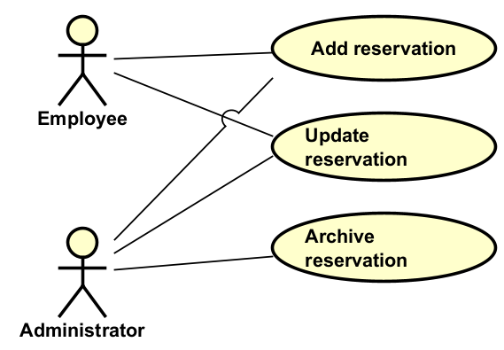
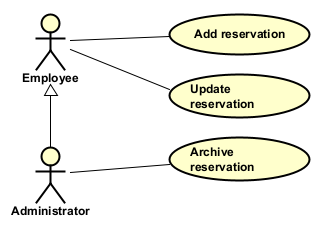

# Extending actors

Your use case diagram will often have more than one actor.

Sometimes different actors do completely different things in the system.
But sometimes, one actor can perform certain use cases, and then another actor can do the same, plus _some extra_ use cases.

For example, two actors A and B can do the following use cases:
- A: Use case 1, Use case 2, Use case 3
- B: Use case 1, Use case 2, Use case 3, Use case 4, Use case 5

So, there is clearly an overlap.

## Draw all the lines

We can already represent the goals, one actor can achieve, with our current knowledge, by just drawing all the lines:

However, as the diagram grows, this becomes impractical.

## Extend

You know about this _concept_ already, one java class extending another. And we use the same arrow. It is about having base behaviour, and extending or adding to it.

Consider the following example:

The arrow from `Administrator` to `Employee` means that `Administrator` can do all the use cases that `Employee` can do, plus some extra.