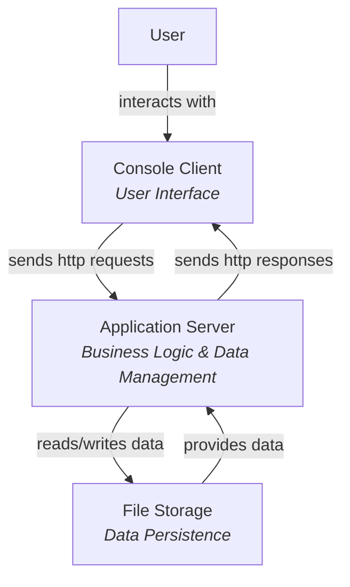

# Components: Architecture Diagram

The first level of the C4 model shows the **high-level system architecture** - the main components that make up your system and how they communicate.

## What is the Components Level?

The Components level is the **most zoomed-out view** of your system. It answers the question:

> **"What are the main parts of the system and how do they connect?"**

At this level, you see:
- Major system components (client, server, database, external services)
- How components communicate with each other
- The boundaries between different parts of the system

## What It Shows

- **Main components** - Client applications, servers, databases, file systems, external APIs
- **Communication paths** - How data flows between components
- **System boundaries** - What's inside your system vs. external systems
- **High-level responsibilities** - What each component is responsible for

## What It Hides

- **Internal structure** - You don't see packages, classes, or implementation details
- **Specific technologies** - While you might show "Database," you don't specify PostgreSQL vs. MySQL
- **Detailed protocols** - You show communication, but not HTTP vs. gRPC details
- **Low-level implementation** - No classes, methods, or data structures

## Audience

This level is ideal for:
- **Stakeholders** - People who need to understand what the system does at a high level
- **Project managers** - Planning and resource allocation
- **Architects** - Initial system design and technology choices
- **New team members** - Getting oriented with the system

## Example: Space Explorer System

Let's look at the Space Explorer System at the Components level:

### Component Descriptions

**Console Client**
- **Purpose**: Provides the user interface for the Space Explorer System
- **Responsibilities**: 
  - Display menus and options to the user
  - Read user input from the console
  - Display results and information
- **Technology**: Java console application
- **Communication**: Uses http requests to the Application Server

**Application Server**
- **Purpose**: Contains all business logic and coordinates system operations
- **Responsibilities**:
  - Process user requests
  - Manage business rules (adding planets, encounters, etc.)
  - Coordinate data operations
  - Validate input
- **Technology**: Java application, Web API
- **Communication**: Receives http requests from Console Client, reads/writes to File Storage

**File Storage**
- **Purpose**: Persists all system data
- **Responsibilities**:
  - Store and retrieve planets, aliens, explorers, and encounters
  - Maintain data integrity
  - Provide data persistence across application restarts
- **Technology**: File-based storage (serialized Java objects)
- **Communication**: Read/write operations from Application Server

## Component Relationships

The diagram shows:

1. **User → Console Client**: User interacts with the console interface
2. **Console Client ↔ Application Server**: Bidirectional communication for requests and responses
3. **Application Server ↔ File Storage**: Bidirectional data access for reading and writing

## Key Characteristics

At this level, notice:

- **Simple and clear** - Easy to understand at a glance
- **High-level technologies** - Focuses on what technologies are used, not how they are implemented
- **High-level responsibilities** - Each component has a clear purpose
- **Communication** - Shows how data and requests flow between components

