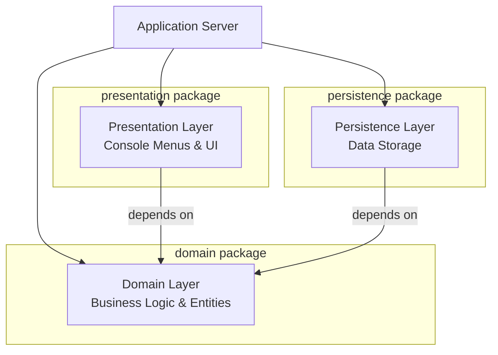
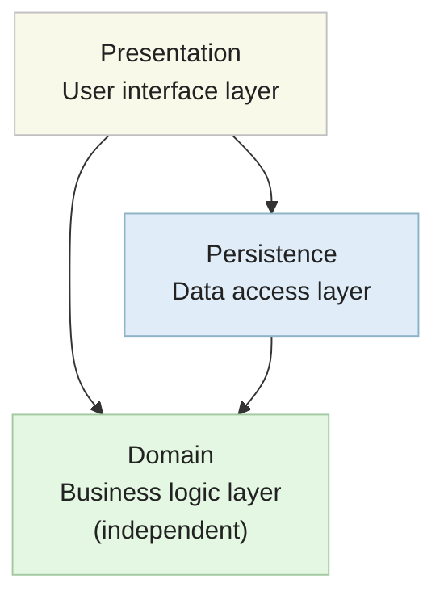

# Compartments: Package Diagram

The second level of the C4 model shows the **internal organization** of components - how they are divided into packages and layers.

## What is the Compartments Level?

The Compartments level zooms into a component to show its **package structure**. It answers the question:

> **"How is this component organized internally?"**

At this level, you see:
- Packages within a component
- How packages are organized (often into layers)
- Dependencies between packages
- Logical groupings of related functionality

## What It Shows

- **Package structure** - How code is organized into packages
- **Layered architecture** - Presentation, Domain, Persistence layers (common pattern)
- **Package dependencies** - Which packages depend on which other packages
- **Logical groupings** - Related functionality grouped together
- **Module boundaries** - Clear separation of concerns

## What is _not_ shown

- **Individual classes** - You don't see specific classes yet
- **Class relationships** - No associations, inheritance, or dependencies between classes
- **Methods and attributes** - No implementation details
- **Specific functionality** - General package purpose, not detailed operations


## Example: Space Explorer System

Let's zoom into the **Application Server** component to see its package structure:

<div style="font-size: 2em; color: red; font-weight: bold; text-align: center;">
    ... INSERT ASTAH DIAGRAM!!
</div>

Or using a more visual package diagram:




## Layered Architecture

The Space Explorer System follows a **layered architecture** pattern:




## Package Structure in Code

The actual package structure looks like:

```
📁 extraterrestrialexploration/
├── 📁 presentation/
│   ├── 📁 planetmanagement/
│   │   ├── PlanetMenu.java
│   │   ├── AddPlanet.java
│   │   ├── ListPlanets.java
│   │   └── ...
│   └── ...
├── 📁 domain/
│   ├── Planet.java
│   ├── Alien.java
│   ├── Explorer.java
│   └── Encounter.java
└── 📁 persistence/
    ├── DataManager.java
    ├── FileDataManager.java
    └── DataContainer.java
```

