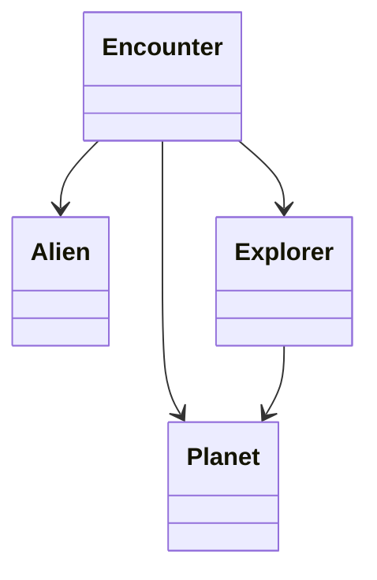

# Classes: Structure Diagram

The third level of the C4 model shows the **class structure** - the classes within a package and how they relate to each other. But without showing the methods and attributes of the classes. It is a _low detail_ class diagram.

## What is the Classes Level?

The **Classes** level zooms into a package to show its **class structure**, including packages. It answers the question:

> **"What classes exist and how do they relate to each other?"**

At this level, you see:
- Class names
- Relationships between classes (associations, dependencies, inheritance)
- Basic structure and organization
- Interfaces and their implementations

## What It Shows

- **Class names** - All classes in the package (or a subset)
- **Relationships** - Associations, dependencies, inheritance, interfaces
- **Structure** - How classes are connected
- **Interfaces** - Interface definitions and implementations
- **Multiplicities** - When relevant. How many objects are related (1, many, etc.)

## What is _not_ shown

- **Methods** - No method names, signatures, or parameters
- **Attributes** - No field variables or properties
- **Implementation details** - No code, no logic
- **Method parameters** - No details about what methods take or return
- **Visibility modifiers** - No public/private/protected indicators

## Example: Space Explorer System

Let's zoom into the **domain package** to see its class structure:

## When to Create This Diagram

This is generally a decent idea to include, if your class diagram is unwieldy and large. It can help provide a better overview, before the class diagam zooms in on details.

## ASTAH!!!!