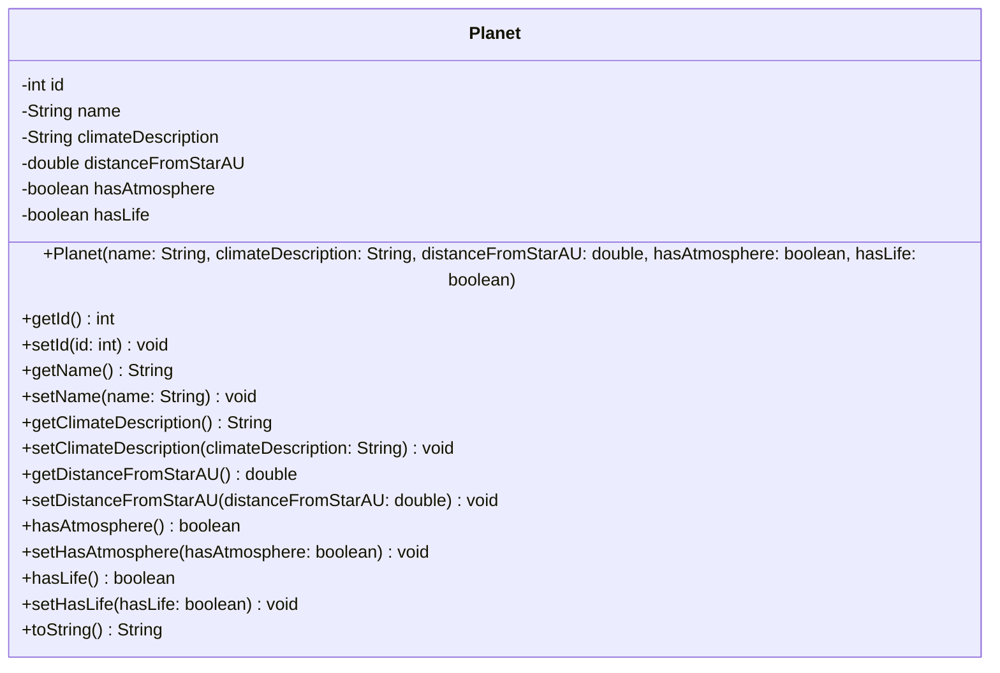
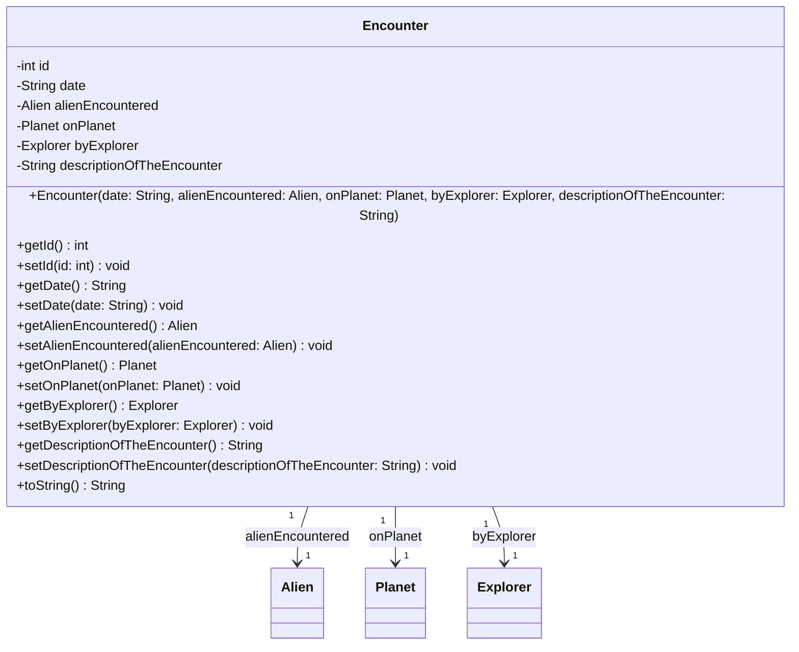

# Complete: Full Class Diagram

The fourth and final level of the C4 model shows the **complete implementation details** - everything you need to implement the code.

## What is the Complete Level?

The Complete level shows **all implementation details**. This is your standard class diagram. 

It answers the question:

> **"What are all the details needed to implement this code?"**

At this level, you see:
- All attributes with their types
- All methods with full signatures (parameters and return types)
- Visibility modifiers (public, private, protected)
- Relationships with multiplicities
- Interfaces and their implementations
- Everything needed to write the actual code

## What It Shows

- **All attributes** - Every field variable with type and name
- **All methods** - Every method with full signature
- **Method parameters** - Parameter names and types
- **Return types** - What each method returns
- **Visibility modifiers** - Public (+), private (-), protected (#)
- **Relationships** - All associations with multiplicities
- **Interfaces** - Interface definitions and implementations
- **Constructors** - Constructor signatures
- **Special methods** - toString(), equals(), hashCode(), etc.

## What It Hides

- **Nothing!** - This is the most detailed view
- All implementation details are visible
- Everything needed for coding is shown

## Audience

This level is ideal for:
- **Implementing developers** - Writing the actual code
- **Code reviewers** - Reviewing implementation details
- **Technical documentation** - Complete technical reference
- **Code generation** - Can be used to generate skeleton code

## Example: Space Explorer System

Let's see the **complete** class diagrams for selected classes from the domain package:

### Planet Class (Complete)

**Attributes:**
- `-int id` - Unique identifier for the planet (private)
- `-String name` - Name of the planet (private)
- `-String climateDescription` - Description of the planet's climate (private)
- `-double distanceFromStarAU` - Distance from star in Astronomical Units (private)
- `-boolean hasAtmosphere` - Whether the planet has an atmosphere (private)
- `-boolean hasLife` - Whether the planet has life (private)

**Methods:**
- Constructor with parameters for all attributes except id
- Getter and setter for each attribute
- `toString()` - Returns string representation

### Encounter Class (Complete)

