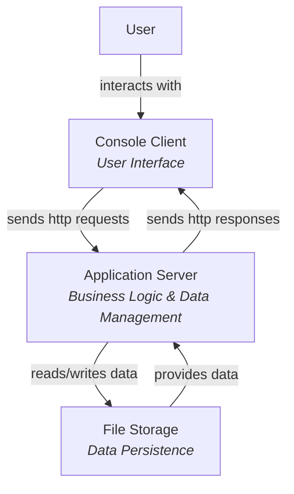
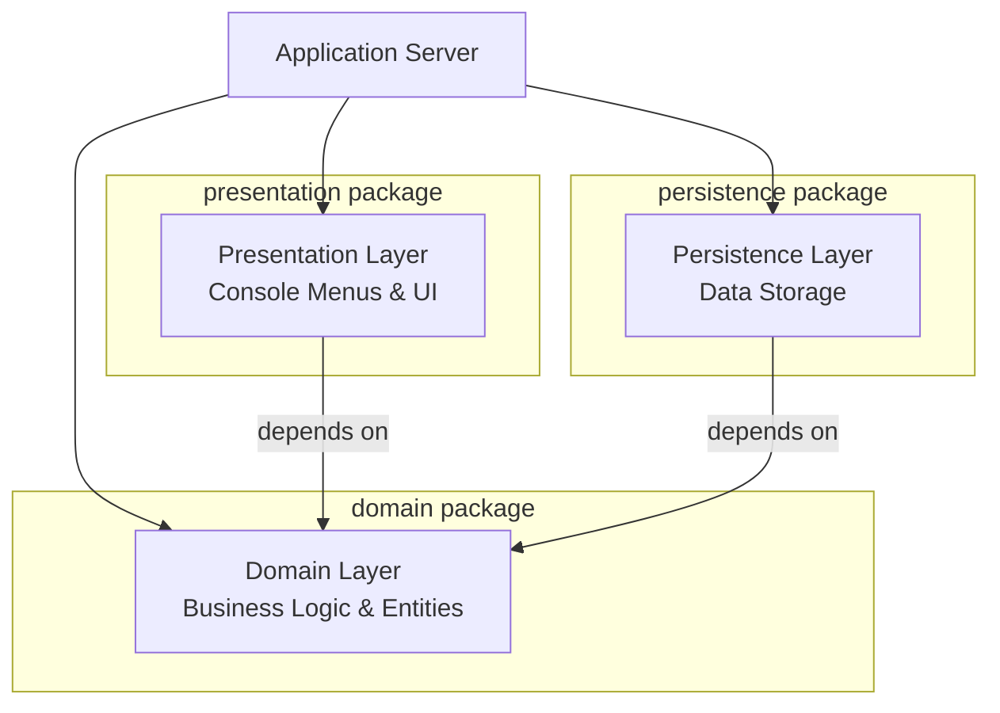
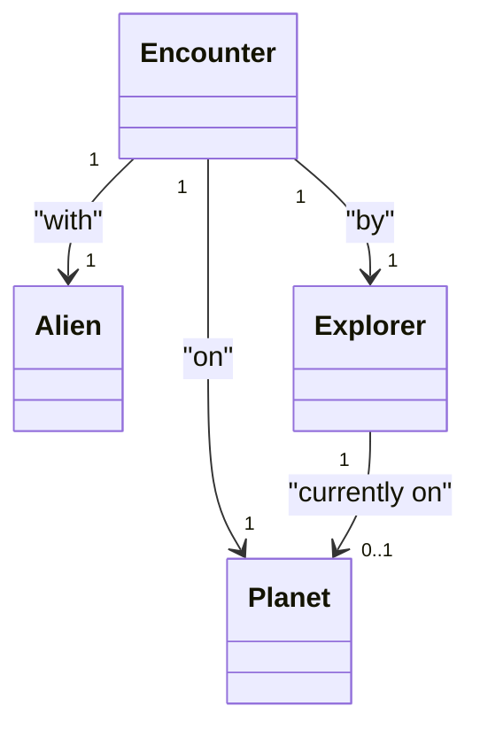
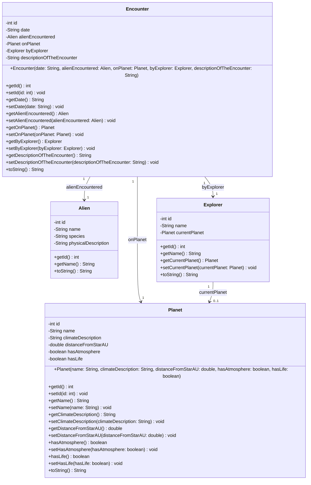

# Zooming Through Levels: A Complete Example

Let's walk through a complete example, zooming through all four levels of the C4 model using the Space Explorer System. This demonstrates how each level reveals more detail about the same system.

## Level 1: Components - The Big Picture

We start with the **highest level view** - the main components of the system:




**What we see:**
- Three main components: Console Client, Application Server, File Storage
- How they communicate
- High-level responsibilities

**What we don't see:**
- Internal structure of any component
- Packages or classes
- Implementation details


## Level 2: Compartments - Zooming into Application Server

Now let's **zoom into the Application Server** component to see its internal organization:



**What we see:**
- Three packages: presentation, domain, persistence
- Layered architecture
- Package dependencies (both depend on domain)

**What we don't see:**
- Individual classes
- Methods or attributes
- Class relationships

---

## Level 3: Classes - Zooming into Domain Package

Now let's **zoom into the Domain package** to see its class structure:



**What we see:**
- Four classes: Planet, Alien, Explorer, Encounter
- Relationships between classes
- Multiplicities (how many objects are related)

**What we don't see:**
- Attributes of each class
- Methods of each class
- Implementation details

---

## Level 4: Complete - Zooming into Full Details

Finally, let's see the **complete implementation details** for the domain classes:



**What we see:**
- **Everything!** All attributes with types
- All methods with full signatures
- Parameter types and return types
- Visibility modifiers (public +, private -)
- Complete relationships

**What we don't see:**
- Nothing - this is the most detailed view!

---

## The Zoom Effect

Here's a visual summary of the zoom effect:

```
┌─────────────────────────────────────────────┐
│  LEVEL 1: COMPONENTS                        │
│  Console Client, Application Server,        │
│  File Storage                               │
└─────────────────────────────────────────────┘
                    ↓ ZOOM IN
┌─────────────────────────────────────────────┐
│  LEVEL 2: COMPARTMENTS                      │
│  (Application Server)                       │
│  presentation, domain, persistence          │
└─────────────────────────────────────────────┘
                    ↓ ZOOM IN
┌─────────────────────────────────────────────┐
│  LEVEL 3: CLASSES                           │
│  (Domain package)                           │
│  Planet, Alien, Explorer, Encounter         │
│  + relationships                            │
└─────────────────────────────────────────────┘
                    ↓ ZOOM IN
┌─────────────────────────────────────────────┐
│  LEVEL 4: COMPLETE                          │
│  (Domain classes)                           │
│  All attributes, all methods,               │
│  full signatures, everything!               │
└─────────────────────────────────────────────┘
```

## Navigating Between Levels

### Zooming In (More Detail)

To zoom in, ask:
- **From Components → Compartments**: "How is this component organized?"
- **From Compartments → Classes**: "What classes are in this package?"
- **From Classes → Complete**: "What are all the details of this class?"

### Zooming Out (Less Detail)

To zoom out, ask:
- **From Complete → Classes**: "What's the overall structure?"
- **From Classes → Compartments**: "How are these classes organized?"
- **From Compartments → Components**: "What component does this belong to?"

## Example: Following a Feature

Let's follow a feature through all levels:

### Feature: "Add a new planet"

**Level 1 - Components:**
- User interacts with Console Client
- Console Client communicates with Application Server
- Application Server uses File Storage

**Level 2 - Compartments (Application Server):**
- Presentation package handles user input
- Presentation calls Domain package
- Domain validates and creates Planet
- Persistence package saves to File Storage

**Level 3 - Classes (Domain package):**
- `AddPlanet` class (presentation) uses `Planet` class (domain)
- `Planet` class has relationships with other entities

**Level 4 - Complete:**
- `AddPlanet` class with all methods:
  - `handleAddPlanet()`
  - Input validation logic
- `Planet` class with all attributes and methods:
  - Constructor: `Planet(name, climateDescription, ...)`
  - Getters and setters
  - `toString()` method

## Benefits of Multiple Levels

1. **Different audiences** - Each level serves different stakeholders
2. **Progressive understanding** - Learn step by step, don't get overwhelmed
3. **Focus** - See only what you need at each level
4. **Communication** - Use the right level for your audience
5. **Documentation** - Complete documentation at multiple abstraction levels

## When to Create Which Level

You don't need to create all levels for everything! Create the level that's appropriate:

- **Starting a project?** Create Components level first
- **Designing architecture?** Create Compartments level
- **Designing classes?** Create Classes level
- **Implementing?** Create Complete level

Often, you'll create higher levels first and add detail as you need it.

## Summary

The zoom effect:

- **Level 1 (Components)**: See the forest - main components
- **Level 2 (Compartments)**: See the trees - package organization
- **Level 3 (Classes)**: See the branches - class structure
- **Level 4 (Complete)**: See the leaves - every detail

Each level reveals more detail, building understanding progressively. Use the level that's appropriate for your audience and purpose!

