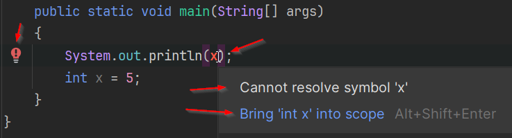

# Scope

On the previous page, you saw multiple lines of code.\
You saw that a variable was declared, and then a value was assigned to it.\
The value of the variable was then printed out to the console.

**Scope** refers to the part of the code where a variable can be accessed or used.

It is important to understand early on, so that's why this page is injected as an interlude here.

Scope sort of comes at different levels in the code, so we start simple.

## Order of execution

The Java runtime will execute your code, one statement at a time, from top to bottom.

This means that the first line of code will be executed first, then the second line, and so on.

This should not be a surprise.

Now, let's inspect the following code snippet:

```java
System.out.println(x);
int x = 5; 
```

You can put this in a main method, what happens?

You should see the variable `x` in a red color. 
Red usually indicates some kind of error, which must be fixed before the program can be run.\
If you mouse over that `x`, IntelliJ will tell you, there is an error in your code.

Observe:



Notice `x` is red. If I hover the mouse over x, you will see the grey popup, explaining the problem.\
You can also click on the red light bulb, which should appear upon mouse over. Click it to get a suggestion to fix the problem.

The error says "Cannot resolve symbol x". You have used symbol, but the compiler cannot find x, because it is declared below.\
When the compiler reached this line of code, it had not yet seen the declaration of `x`, so it does not know what `x` is.

The blue line suggests a fix. You can probably click it, and IntelliJ will attempt to automatically fix things for your.\
Don't do this. I strongly recommend doing things as manually as possible, until you understand what is going on.

Now, try moving the line of code `System.out.println(x);` below the declaration of `x`:

```java
int x = 5;
System.out.println(x);
```

Your error should now be gone, and the program should run successfully, printing `5` to the console.
