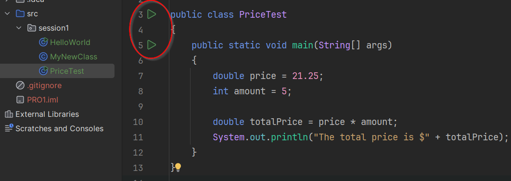
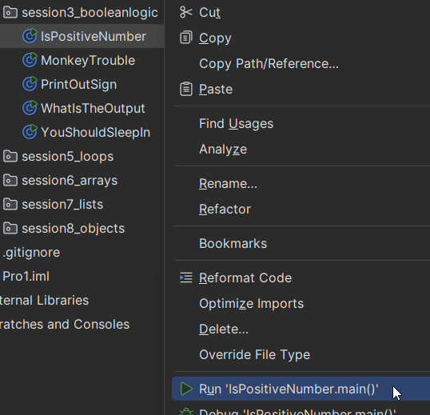
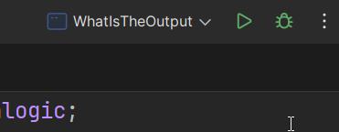

# The Main method

A method is a collection of commands (statements) that perform a specific task. 

We will get back to methods in detail later, but for now, we will focus on the `main` method, which is essential for running any Java program.

In Java, the `main` method is the entry point of any Java application. It is where the program starts executing. It is the button, we press, to start the machine.

The main method has a specific structure, and is defined as follows:

```java
public static void main(String[] args) {
    // Your code here
}
```

Between the curly braces `{..}` is where you will write the code that you want to execute when the program runs.\
This part is called the **method body**.


A few important points about the `main` method, which may not all make sense yet:

1. **Public**: The `main` method must be declared as `public` so that the Java Virtual Machine (JVM) can access it.
2. **Static**: The `main` method is declared as `static` so that it can be called without creating an instance of the class.
3. **Void**: The `main` method does not return any value, hence it is declared as `void`.
4. **String[] args**: This parameter allows the program to accept command-line arguments. It is an array of `String` objects that can be used to pass information to the program when it is executed.
5. **Method Body**: The code inside the curly braces `{ }` is where you write the statements that will be executed when the program runs.

Most of the above may not make sense right now, but we will cover these concepts in detail as we progress through the course. The point is that the `main` method has a very specific structure (or _signature_) that must be followed for the program to run correctly.

You can think of the `main` method as the starting point of your Java program, where you will write the code that you want to execute when the program runs.

Most of the following exercises will just be writing some code inside the `main` method to see how it works.

## Running a main method

In IntelliJ you can run a main method in several ways. The simplest is just clicking the green play button next to the `main` method declaration.



You can also right click the file in the project window, and select run:

.

Or you select a specific file (with a main method) in the drop down at the top right, and then the green play button:



There are even more ways, but now you have enough options. It does not matter which you pick.


## Video

Here is John explaining the main method in 7 minutes. John has many fine videos, I will use him occasionally.

<video src="https://www.youtube.com/watch?v=P-_Nzi_mCRo"></video>