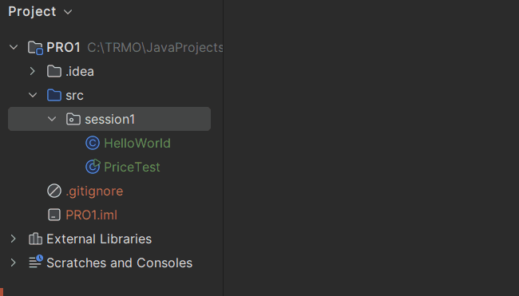
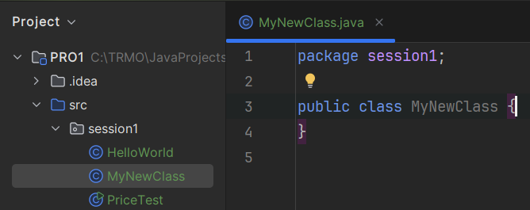

# Classes

A class is also something we will elaborate on later.

For now, each exercise will be a new class, with a `main` method inside it.

Watch here how a new class is created in IntelliJ IDEA: 

And the end result looks like this:

Notice a new file is created in the session1 package.