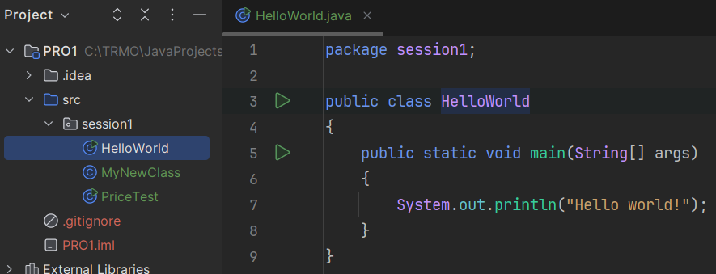
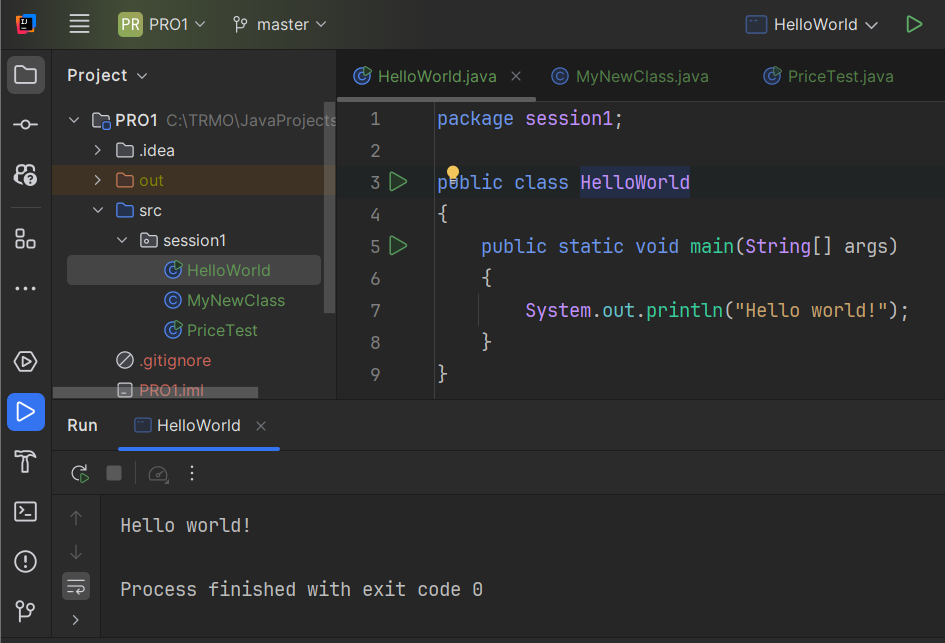

# Printing to console

Quite often, you will want to print something to the console. This is useful for showing some information to the developer. For the majority of PRO1 this is how you will see the output of your code. 

Towards the end, we will add an actual Graphical User Interface (GUI) to the programs we create.

The command to print something to the console is `System.out.println()`.

Between the parentheses `()` you can put any text you want to print.\
Text is surrounded by double quotes `"`.

```java
"Hello, World!"
```

Each time you execute `System.out.println()`, it will print the text to the console and then move to a new line.

## Exercise 1: Print a message

Create a new class called `PrintMessage` and write a program that prints the message "Hello, World!" to the console.


<hint title="Hint 1">

Create a new class in the `session1` package.

</hint>

<hint title="Hint 2">

Inside the class, write a `main` method.

</hint>

<hint title="Hint 3">

Inside the `main` method body, use the `System.out.println` method to print "Hello, World!" to the console.

</hint>


<hint title="Solution">

This is what your class should look like:



When you run the program, the console should automatically open and display the message "Hello, World!":




</hint>

<hint title="Video solution">

<video src="https://youtu.be/Op6m6Wp_y2c"></video>

</hint>