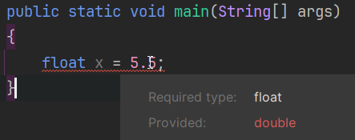

# Declaring numbers

In java, because some numbers look similar, we must sometimes specify what kind of number we are using.

For example, is `3` a short, an int, or a long?

The variable type specifies what kind of number it is, but sometimes the value must also specify the type.

For example:

```java
short myShort = 3; // This is a short integer
int myInt = 3; // This is an integer
long myLong = 3L; // This is a long integer
double myDouble = 3.0; // This is a double (floating-point number)
float myFloat = 3.0f; // This is a float (single-precision floating-point number)
```

Notice the `L` and `f` at the end of the `long` and `float` values.\
If you forget, you will get an error from the Java compiler:



Notice the red squiggly line, indicating an error in your program. When you mouse over the error, it will show you a tool tip, explaining the problem.


