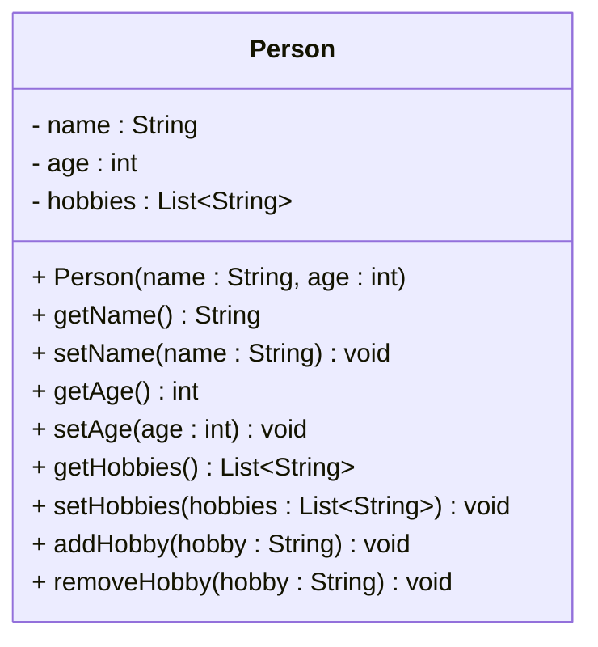

# Exercise: Implement a Person Class

Create a Java class called `Person` with the following requirements:

## Fields:
- `name` (String) - private
- `age` (int) - private  
- `hobbies` (List<String>) - private

## Methods:
- Constructor that initializes all fields
- Getter and setter methods for all fields
- A method to add a hobby to the list
- A method to remove a hobby from the list

## UML Class Diagram:


## Requirements:
1. Use appropriate access modifiers for all fields and methods
2. Initialize the hobbies list as an empty ArrayList in the constructor
3. The `addHobby` method should add a hobby to the list if it's not already present
4. The `removeHobby` method should remove a hobby from the list if it exists
5. Include proper JavaDoc comments for all public methods

## Example Usage:
```java
Person person = new Person("Alice", 25);
person.addHobby("Reading");
person.addHobby("Swimming");
person.addHobby("Reading"); // Should not add duplicate

System.out.println(person.getName()); // Alice
System.out.println(person.getHobbies()); // [Reading, Swimming]

person.removeHobby("Reading");
System.out.println(person.getHobbies()); // [Swimming]
```

## Hints:
- Remember to import `java.util.List` and `java.util.ArrayList`
- Use `this` keyword in the constructor to distinguish between parameters and fields
- The `addHobby` method should check if the hobby already exists before adding it
- The `removeHobby` method should check if the hobby exists before trying to remove it

## Expected Output:
When you run the example usage code above, you should see:
```
Alice
[Reading, Swimming]
[Swimming]
```
