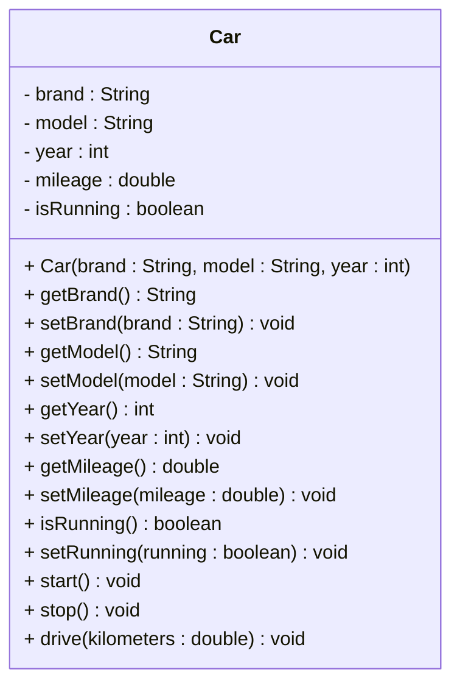

# Exercise: Implement a Car Class

Create a Java class called `Car` with the following requirements:

## Fields:
- `brand` (String) - private
- `model` (String) - private  
- `year` (int) - private
- `mileage` (double) - private
- `isRunning` (boolean) - private

## Methods:
- Constructor that initializes all fields
- Getter and setter methods for all fields
- A method to start the car
- A method to stop the car
- A method to drive the car (adds kilometers to mileage)

## UML Class Diagram:


## Requirements:
1. Use appropriate access modifiers for all fields and methods
2. Initialize `mileage` to 0.0 and `isRunning` to false in the constructor
3. The `start()` method should set `isRunning` to true and print a message
4. The `stop()` method should set `isRunning` to false and print a message
5. The `drive()` method should only add kilometers if the car is running, otherwise print an error message
6. Include proper JavaDoc comments for all public methods

## Example Usage:
```java
Car car = new Car("Toyota", "Camry", 2020);
System.out.println(car.getBrand() + " " + car.getModel() + " " + car.getYear());

car.start();
car.drive(50.5);
car.drive(25.0);
car.stop();
car.drive(10.0); // Should not work - car is stopped

System.out.println("Total mileage: " + car.getMileage() + " kilometers");
```

## Hints:
- The `start()` method should check if the car is already running
- The `stop()` method should check if the car is already stopped
- The `drive()` method should check if the car is running before adding kilometers
- Consider using `System.out.println()` for status messages

## Expected Output:
When you run the example usage code above, you should see:
```
Toyota Camry 2020
Car started!
Drove 50.5 kilometers
Drove 25.0 kilometers
Car stopped!
Cannot drive - car is not running!
Total mileage: 75.5 kilometers
```
