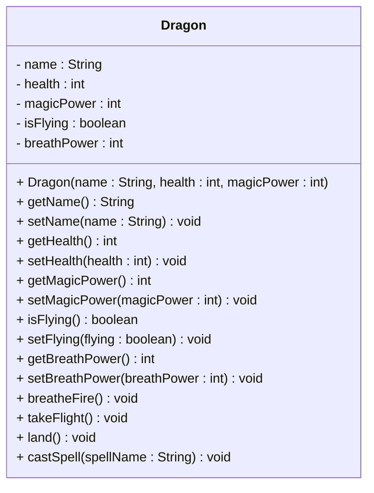

# Exercise: Implement a Dragon Class

This exercise models a fantasy dragon creature with magical abilities, flight capabilities, and various actions. You'll create a class that represents a dragon with properties like health, magic power, and the ability to breathe fire, cast spells, and take flight.

Create a Java class called `Dragon` with the following requirements:

## Fields:
- `name` (String) - private - Example: "Smaug", "Toothless", "Drogon"
- `health` (int) - private - Example: 100, 80, 150
- `magicPower` (int) - private - Example: 50, 40, 75
- `isFlying` (boolean) - private - Example: false, true
- `breathPower` (int) - private - Example: 25, 20, 30

## Methods:
- Constructor that initializes all fields
- Getter and setter methods for all fields
- A method to breathe fire (reduces magic power)
- A method to take flight
- A method to land
- A method to cast a spell

## UML Class Diagram:


## Requirements:
1. Use appropriate access modifiers for all fields and methods
2. Initialize `isFlying` to false in the constructor
3. The `breatheFire()` method should reduce magic power by 10 and print a fire message
4. The `takeFlight()` method should set `isFlying` to true and print a message
5. The `land()` method should set `isFlying` to false and print a message
6. The `castSpell()` method should reduce magic power by 5 and print the spell name

## Example Usage:
```java
Dragon dragon1 = new Dragon("Smaug", 100, 50);
Dragon dragon2 = new Dragon("Toothless", 80, 40);

System.out.println(dragon1.getName() + " vs " + dragon2.getName());

dragon1.takeFlight();
dragon1.breatheFire();
dragon1.castSpell("Lightning Bolt");

dragon2.takeFlight();
dragon2.breatheFire();

System.out.println(dragon1.getName() + " health: " + dragon1.getHealth());
System.out.println(dragon2.getName() + " health: " + dragon2.getHealth());
```

## Hints:
- The `breatheFire()` method should check if the dragon has enough magic power, otherwise print an error message (e.g. "the fire sputtered out")
- The `castSpell()` method should check if the dragon has enough magic power, otherwise print an error message (e.g. "the spell failed")
- Consider using `System.out.println()` for action messages

## Expected Output:
When you run the example usage code above, you should see:
```
Smaug vs Toothless
Smaug takes flight!
Smaug breathes fire! (Magic power: 40)
Smaug casts Lightning Bolt! (Magic power: 35)
Toothless takes flight!
Toothless breathes fire! (Magic power: 30)
Smaug health: 100
Toothless health: 80
```

## Bonus Challenge:
Add validation to ensure:
- Health cannot be negative
- Magic power cannot be negative
- Dragons cannot breathe fire or cast spells without sufficient magic power

Print errors to the console, when relevant.
