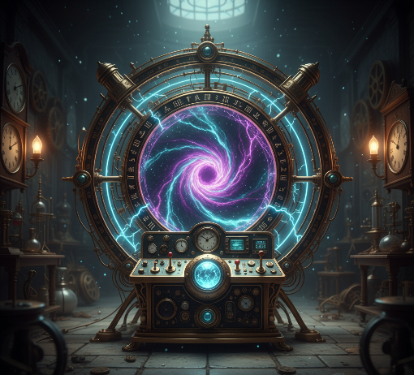
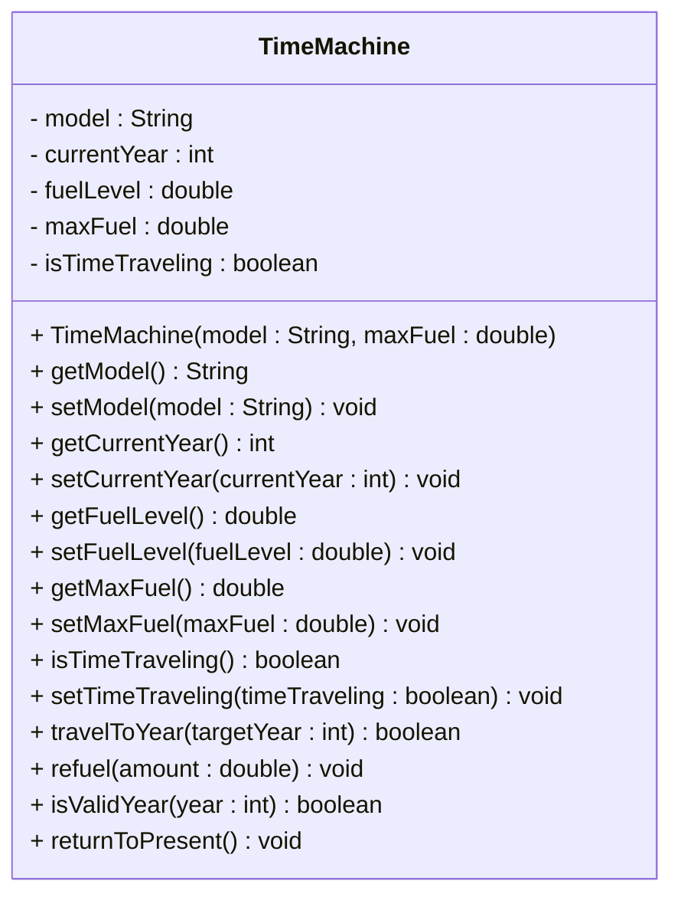

# Exercise: Implement a Time Machine Class



This exercise models a time travel device that can journey through different eras while managing fuel consumption and travel constraints. You'll create a class that represents a time machine with properties like current year, fuel level, and the ability to travel through time while respecting fuel limits and temporal boundaries.

Create a Java class called `TimeMachine` with the following requirements:

## Fields:
- `model` (String) - private - Example: "DeLorean DMC-12", "TARDIS", "Time Turner"
- `currentYear` (int) - private - Example: 2024, 1985, 1955
- `fuelLevel` (double) - private - Example: 100.0, 75.5, 50.0
- `maxFuel` (double) - private - Example: 100.0, 150.0, 200.0
- `isTimeTraveling` (boolean) - private - Example: false, true

## Methods:
- Constructor that initializes all fields
- Getter and setter methods for all fields
- A method to travel to a specific year
- A method to refuel the time machine
- A method to check if a year is valid for travel
- A method to return to the present

## UML Class Diagram:


## Requirements:
1. Use appropriate access modifiers for all fields and methods
2. Initialize `currentYear` to 2024, `fuelLevel` to `maxFuel`, and `isTimeTraveling` to false in the constructor
3. The `travelToYear()` method should check if the year is valid and if there's enough fuel
4. Fuel consumption should be based on the distance traveled (1 fuel per 10 years)
5. The `refuel()` method should not exceed the maximum fuel capacity
6. The `isValidYear()` method should prevent travel to years before 1900 or after 3000
7. The `returnToPresent()` method should travel back to 2024

## Example Usage:
```java
TimeMachine machine = new TimeMachine("DeLorean DMC-12", 100.0);
System.out.println("Time Machine: " + machine.getModel());
System.out.println("Current year: " + machine.getCurrentYear());

machine.travelToYear(1985);
machine.travelToYear(1955);
machine.travelToYear(2015);

machine.refuel(50.0);
machine.returnToPresent();

System.out.println("Final year: " + machine.getCurrentYear());
System.out.println("Fuel remaining: " + machine.getFuelLevel());
```

## Hints:
- The `travelToYear()` method should check if there's enough fuel, otherwise print an error message (e.g. "Insufficient fuel for time travel")
- The `travelToYear()` method should check if the year is valid, otherwise print an error message (e.g. "Invalid year for time travel")
- The `refuel()` method should check if adding fuel would exceed the maximum, otherwise print an error message (e.g. "Cannot refuel beyond maximum capacity")
- The `isValidYear()` method should return false for invalid years
- Consider using `Math.abs()` to calculate the absolute difference between years
- Consider using `System.out.println()` for action messages

## Expected Output:
When you run the example usage code above, you should see:
```
Time Machine: DeLorean DMC-12
Current year: 2024
Traveling to 1985... Success! (Fuel: 96.1)
Traveling to 1955... Success! (Fuel: 93.0)
Traveling to 2015... Success! (Fuel: 90.1)
Refueling... Added 50.0 fuel (Total: 100.0)
Returning to present... Success! (Fuel: 99.1)
Final year: 2024
Fuel remaining: 99.1
```

## Bonus Challenge:
Add validation to ensure:
- Fuel level cannot be negative or exceed maximum fuel
- Time machine cannot travel if already time traveling
- Add a method to check fuel efficiency
- Prevent paradoxes by blocking travel to certain critical years

Print errors to the console, when relevant.
