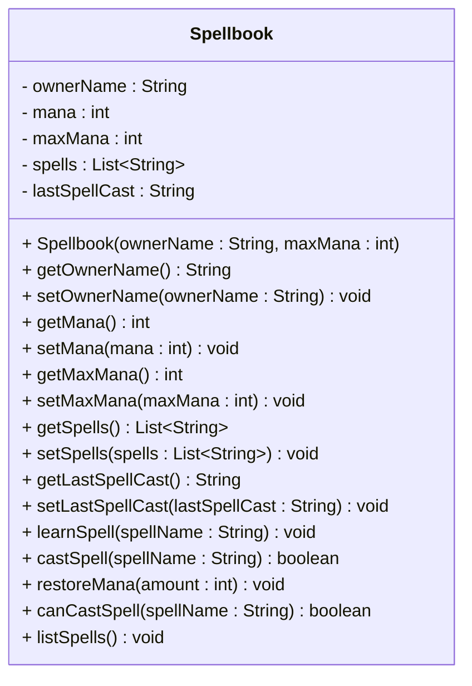

# Exercise: Implement a Wizard's Spellbook Class


This exercise models a magical spellbook that belongs to a wizard, containing various spells and managing mana consumption. You'll create a class that represents a spellbook with properties like owner name, mana levels, and the ability to learn, cast, and manage spells while tracking mana usage.

Create a Java class called `Spellbook` with the following requirements:

## Fields:
- `ownerName` (String) - private - Example: "Gandalf", "Merlin", "Harry Potter"
- `mana` (int) - private - Example: 100, 75, 50
- `maxMana` (int) - private - Example: 100, 150, 200
- `spells` (List<String>) - private - Example: ["Fireball", "Heal", "Lightning"]
- `lastSpellCast` (String) - private - Example: "Fireball", "Heal", "Lightning"

## Methods:
- Constructor that initializes all fields
- Getter and setter methods for all fields
- A method to learn a new spell
- A method to cast a spell
- A method to restore mana
- A method to check if a spell can be cast
- A method to list all known spells

## UML Class Diagram:


## Requirements:
1. Use appropriate access modifiers for all fields and methods
2. Initialize `mana` to `maxMana`, `spells` as empty ArrayList, and `lastSpellCast` to empty string in the constructor
3. The `learnSpell()` method should add a spell to the list if it's not already known
4. The `castSpell()` method should check if the spell is known and if there's enough mana
5. You may decide on spell mana cost, either a fixed amount, or a random amount between 1 and 10
6. The `restoreMana()` method should not exceed the maximum mana capacity
7. The `canCastSpell()` method should check both spell knowledge (and mana availability, if mana is not randomly chosen). 

## Example Usage:
```java
Spellbook book = new Spellbook("Gandalf", 100);
System.out.println("Spellbook owner: " + book.getOwnerName());

book.learnSpell("Fireball");
book.learnSpell("Heal");
book.learnSpell("Lightning");

book.listSpells();

book.castSpell("Fireball");
book.castSpell("Heal");
book.castSpell("Unknown Spell");

book.restoreMana(50);
System.out.println("Current mana: " + book.getMana());
```

## Hints:
- The `castSpell()` method should check if the spell is known, otherwise print an error message (e.g. "Spell not known")
- The `castSpell()` method should check if there's enough mana, otherwise print an error message (e.g. "Insufficient mana")
- The `learnSpell()` method should check if the spell already exists before adding, otherwise print an error message (e.g. "Spell already known")
- The `restoreMana()` method should check if adding mana would exceed the maximum, otherwise print an error message (e.g. "Cannot restore beyond maximum mana")
- The `castSpell()` method should use a switch statement or if-else to determine mana cost
- Consider using `List.contains()` to check if a spell is already known
- Consider using `System.out.println()` for action messages

## Expected Output:
When you run the example usage code above, you should see:
```
Spellbook owner: Gandalf
Learning Fireball...
Learning Heal...
Learning Lightning...
Known spells: [Fireball, Heal, Lightning]
Casting Fireball... Success! (Mana: 90)
Casting Heal... Success! (Mana: 75)
Casting Unknown Spell... Failed! (Spell not known)
Restoring mana... Added 50 mana (Total: 100)
Current mana: 100
```