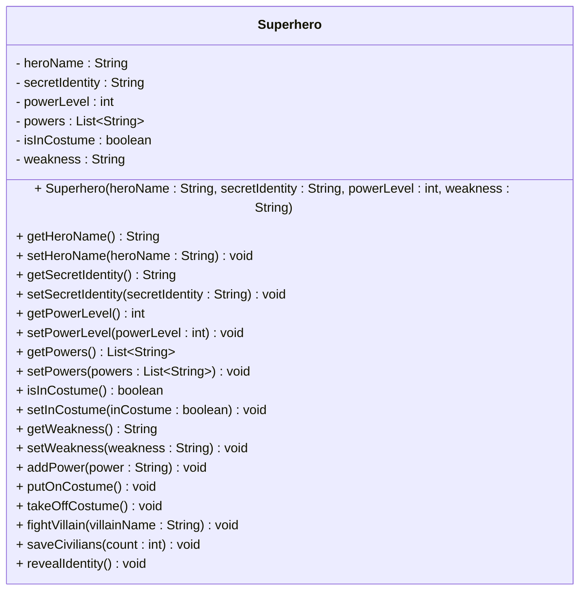

# Exercise: Implement a Superhero Class


This exercise models a superhero character with secret identity, powers, and heroic actions. You'll create a class that represents a superhero with properties like hero name, secret identity, power level, and the ability to fight villains, save civilians, and manage their costume status.

Create a Java class called `Superhero` with the following requirements:

## Fields:
- `heroName` (String) - private - Example: "Superman", "Batman", "Wonder Woman"
- `secretIdentity` (String) - private - Example: "Clark Kent", "Bruce Wayne", "Diana Prince"
- `powerLevel` (int) - private - Example: 100, 85, 95
- `powers` (List<String>) - private - Example: ["Super Strength", "Flight", "Heat Vision"]
- `isInCostume` (boolean) - private - Example: false, true
- `weakness` (String) - private - Example: "Kryptonite", "Fear", "Magic"

## Methods:
- Constructor that initializes all fields
- Getter and setter methods for all fields
- A method to add a new power
- A method to put on costume
- A method to take off costume
- A method to fight a villain
- A method to save civilians
- A method to reveal secret identity

## UML Class Diagram:


## Requirements:
1. Use appropriate access modifiers for all fields and methods
2. Initialize `powers` as empty ArrayList and `isInCostume` to false in the constructor
3. The `addPower()` method should add a power to the list if it's not already present
4. The `putOnCostume()` method should set `isInCostume` to true and print a message
5. The `takeOffCostume()` method should set `isInCostume` to false and print a message
6. The `fightVillain()` method should only work when in costume and should reduce power level
7. The `saveCivilians()` method should increase power level and only work when in costume
8. The `revealIdentity()` method should print the secret identity

## Example Usage:
```java
Superhero hero = new Superhero("Superman", "Clark Kent", 100, "Kryptonite");
System.out.println("Hero: " + hero.getHeroName());

hero.addPower("Super Strength");
hero.addPower("Flight");
hero.addPower("Heat Vision");

hero.putOnCostume();
hero.fightVillain("Lex Luthor");
hero.saveCivilians(5);

hero.takeOffCostume();
hero.revealIdentity();

System.out.println("Current power level: " + hero.getPowerLevel());
```

## Hints:
- The `addPower()` method should check if the power already exists before adding, otherwise print an error message (e.g. "Power already known")
- The `fightVillain()` method should check if the hero is in costume, otherwise print an error message (e.g. "Must be in costume to fight villains")
- The `saveCivilians()` method should check if the hero is in costume, otherwise print an error message (e.g. "Must be in costume to save civilians")
- The `fightVillain()` method should check if power level is sufficient, otherwise print an error message (e.g. "Power level too low to fight")
- Consider using `List.contains()` to check if a power is already present
- Consider using `System.out.println()` for action messages

## Expected Output:
When you run the example usage code above, you should see:
```
Hero: Superman
Adding power: Super Strength
Adding power: Flight
Adding power: Heat Vision
Putting on costume... Ready for action!
Fighting Lex Luthor... Power level: 90
Saving 5 civilians... Power level: 95
Taking off costume... Back to normal life
Secret identity: Clark Kent
Current power level: 95
```

## Bonus Challenge:
Add validation to ensure:
- Power level cannot be negative or exceed 100
- Heroes cannot fight villains without being in costume
- Add a method to check if a hero is vulnerable to their weakness
- Implement a team-up system where heroes can combine powers

Print errors to the console, when relevant.
