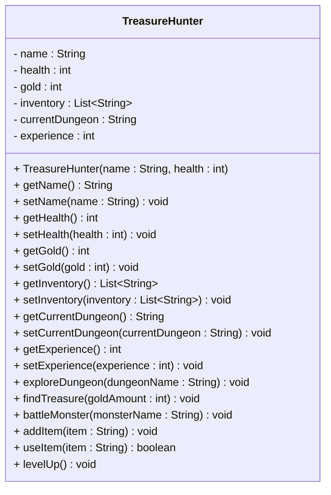

# Exercise: Implement a Treasure Hunter Class

This exercise models an adventurous treasure hunter who explores dungeons, battles monsters, and collects valuable items. You'll create a class that represents a treasure hunter with properties like health, gold, inventory, and the ability to explore dungeons, find treasure, and level up through experience.

Create a Java class called `TreasureHunter` with the following requirements:

## Fields:
- `name` (String) - private - Example: "Indiana Jones", "Lara Croft", "Nathan Drake"
- `health` (int) - private - Example: 100, 75, 120
- `gold` (int) - private - Example: 0, 150, 500
- `inventory` (List<String>) - private - Example: ["Health Potion", "Magic Sword", "Treasure Map"]
- `currentDungeon` (String) - private - Example: "Ancient Temple", "Crystal Cave", "Dragon's Lair"
- `experience` (int) - private - Example: 0, 75, 150

## Methods:
- Constructor that initializes all fields
- Getter and setter methods for all fields
- A method to explore a dungeon
- A method to find treasure
- A method to battle a monster
- A method to add item to inventory
- A method to use an item
- A method to level up

## UML Class Diagram:


## Requirements:
1. Use appropriate access modifiers for all fields and methods
2. Initialize `gold` to 0, `inventory` as empty ArrayList, `currentDungeon` to empty string, and `experience` to 0 in the constructor
3. The `exploreDungeon()` method should set the current dungeon and print a message
4. The `findTreasure()` method should add gold and experience, and print a message
5. The `battleMonster()` method should reduce health by 10-30 points and add experience
6. The `addItem()` method should add an item to the inventory if there's space (max 10 items)
7. The `useItem()` method should remove an item from inventory and restore health
8. The `levelUp()` method should trigger when experience reaches 100 and reset experience to 0

## Example Usage:
```java
TreasureHunter hunter = new TreasureHunter("Indiana Jones", 100);
System.out.println("Adventurer: " + hunter.getName());

hunter.exploreDungeon("Ancient Temple");
hunter.findTreasure(50);
hunter.addItem("Health Potion");
hunter.addItem("Magic Sword");

hunter.battleMonster("Goblin");
hunter.useItem("Health Potion");

hunter.findTreasure(75);
hunter.levelUp();

System.out.println("Health: " + hunter.getHealth());
System.out.println("Gold: " + hunter.getGold());
System.out.println("Experience: " + hunter.getExperience());
```

## Hints:
- The `addItem()` method should check if the inventory has space (max 10 items), otherwise print an error message (e.g. "Inventory full")
- The `useItem()` method should check if the item exists in the inventory, otherwise print an error message (e.g. "Item not found")
- The `battleMonster()` method should check if health is sufficient, otherwise print an error message (e.g. "Too weak to battle")
- The `battleMonster()` method should use `Random` to determine damage
- The `levelUp()` method should check if experience >= 100
- Consider using `System.out.println()` for action messages

## Expected Output:
When you run the example usage code above, you should see:
```
Adventurer: Indiana Jones
Exploring Ancient Temple...
Found treasure! +50 gold, +25 experience
Added Health Potion to inventory
Added Magic Sword to inventory
Battling Goblin... -20 health, +15 experience
Used Health Potion! +30 health
Found treasure! +75 gold, +25 experience
Level up! Experience reset to 0
Health: 110
Gold: 125
Experience: 0
```

## Bonus Challenge:
Add validation to ensure:
- Health cannot be negative
- Gold cannot be negative
- Inventory cannot exceed 10 items
- Add different types of items with different effects
- Implement a death system when health reaches 0

Print errors to the console, when relevant.
