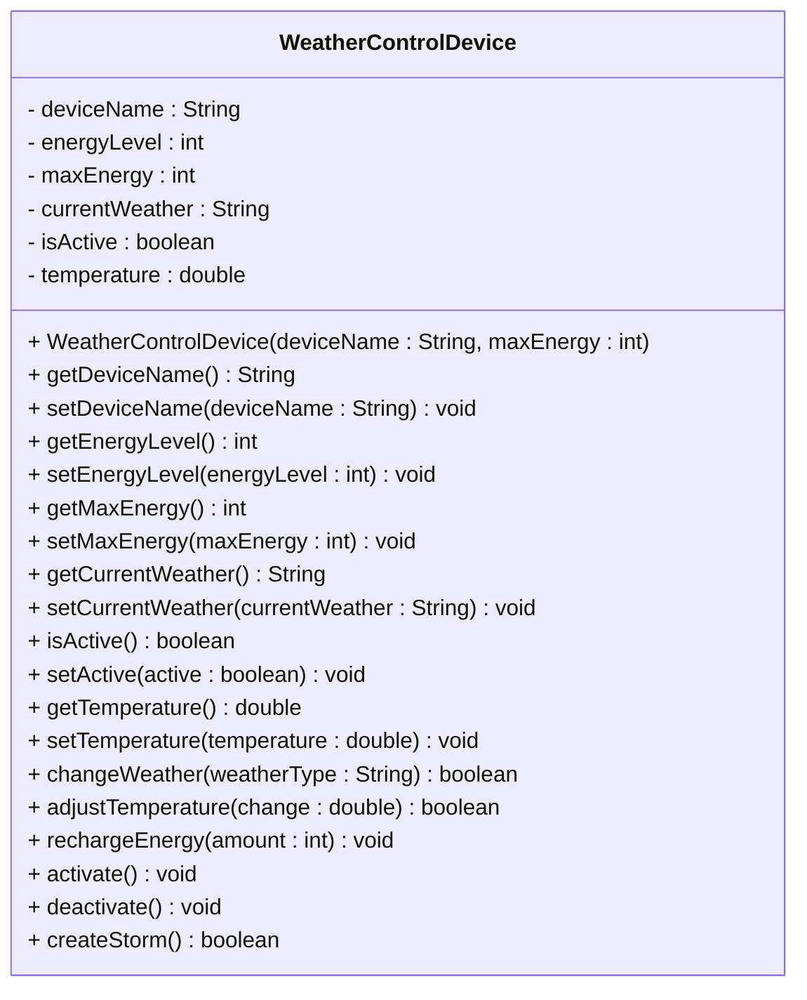

# Exercise: Implement a Weather Control Device Class


This exercise models a futuristic weather control device that can manipulate atmospheric conditions and temperature. You'll create a class that represents a weather control device with properties like energy level, current weather, and the ability to change weather patterns, adjust temperature, and create storms while managing energy consumption.

Create a Java class called `WeatherControlDevice` with the following requirements:

## Fields:
- `deviceName` (String) - private - Example: "Storm Master 3000", "Weather Wizard", "Climate Commander"
- `energyLevel` (int) - private - Example: 100, 75, 50
- `maxEnergy` (int) - private - Example: 100, 150, 200
- `currentWeather` (String) - private - Example: "Sunny", "Rainy", "Stormy"
- `isActive` (boolean) - private - Example: false, true
- `temperature` (double) - private - Example: 20.0, 15.5, 25.0

## Methods:
- Constructor that initializes all fields
- Getter and setter methods for all fields
- A method to change weather
- A method to adjust temperature
- A method to recharge energy
- A method to activate the device
- A method to deactivate the device
- A method to create a storm

## UML Class Diagram:


## Requirements:
1. Use appropriate access modifiers for all fields and methods
2. Initialize `energyLevel` to `maxEnergy`, `currentWeather` to "Sunny", `isActive` to false, and `temperature` to 20.0 in the constructor
3. The `changeWeather()` method should only work when the device is active and consume 10 energy
4. The `adjustTemperature()` method should only work when the device is active and consume 5 energy
5. The `rechargeEnergy()` method should not exceed the maximum energy capacity
6. The `activate()` method should set `isActive` to true and print a message
7. The `deactivate()` method should set `isActive` to false and print a message
8. The `createStorm()` method should consume 25 energy and only work when active

## Example Usage:
```java
WeatherControlDevice device = new WeatherControlDevice("Storm Master 3000", 100);
System.out.println("Device: " + device.getDeviceName());

device.activate();
device.changeWeather("Rainy");
device.adjustTemperature(-5.0);
device.createStorm();

device.changeWeather("Sunny");
device.adjustTemperature(10.0);

device.deactivate();
device.rechargeEnergy(50);

System.out.println("Current weather: " + device.getCurrentWeather());
System.out.println("Temperature: " + device.getTemperature() + "°C");
System.out.println("Energy level: " + device.getEnergyLevel());
```

## Hints:
- The `changeWeather()` method should check if the device is active, otherwise print an error message (e.g. "Device must be active")
- The `changeWeather()` method should check if there's enough energy, otherwise print an error message (e.g. "Insufficient energy")
- The `adjustTemperature()` method should check if the device is active, otherwise print an error message (e.g. "Device must be active")
- The `adjustTemperature()` method should check if there's enough energy, otherwise print an error message (e.g. "Insufficient energy")
- The `rechargeEnergy()` method should check if adding energy would exceed the maximum, otherwise print an error message (e.g. "Cannot recharge beyond maximum energy")
- Consider using `System.out.println()` for status messages

## Expected Output:
When you run the example usage code above, you should see:
```
Device: Storm Master 3000
Device activated! Ready to control weather.
Changing weather to Rainy... Success! (Energy: 90)
Adjusting temperature by -5.0°C... Success! (Energy: 85)
Creating storm... Success! (Energy: 60)
Changing weather to Sunny... Success! (Energy: 50)
Adjusting temperature by 10.0°C... Success! (Energy: 45)
Device deactivated. Weather control disabled.
Recharging energy... Added 50 energy (Total: 95)
Current weather: Sunny
Temperature: 25.0°C
Energy level: 95
```

## Bonus Challenge:
Add validation to ensure:
- Energy level cannot be negative or exceed maximum energy
- Temperature cannot go below -50°C or above 50°C
- Add different weather types with different energy costs
- Implement weather effects on the environment

Print errors to the console, when relevant.
