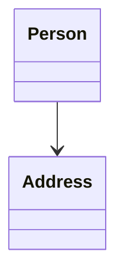

# Association in UML Diagrams

UML (Unified Modeling Language) provides a standardized way to represent association relationships between classes. 

## Basic Association Notation

In UML class diagrams, association is represented by a **solid line** with an "open" arrowhead at one end, connecting two classes. 

For example:



This means Person knows about Address, but Address doesn't necessarily know about Person.

And in code, this relationship is implemented by having a field variable of Address in Person. Like this:

```java
public class Person {
    private Address address;

    public Person(Address address) {
        this.address = address;
    }
}
```

The direction of the arrowhead is important. It _starts_ at the class with the field variable. And _points_ to the class that is the _type_ of the field variable.
