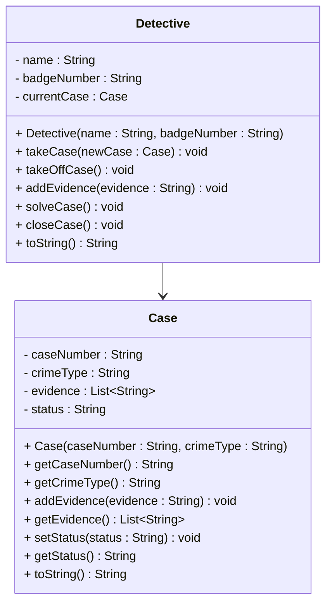

# Association Exercises

Practice implementing association relationships in Java with these fun and interesting exercises.


## Exercise 1: Detective and Case

Build a `Detective` class and a `Case` class where each detective works on one active case at a time. The case contains evidence and clues.

### Requirements:
- `Case` class with case number, crime type, evidence list, and status
- `Detective` class with name and current case
- Methods to investigate, add evidence, and solve cases
- Ability to take on new cases (closing the previous one)

### UML Diagram:



For the `Detective` class, you have the following methods, with specified behaviour:

- `takeCase(newCase : Case) void`: This method takes a new case and assigns it to the detective.
- `takeOffCase() void`: This method takes the detectiveoff the current case. You do this by setting the current case to null.
- `addEvidence(evidence : String) void`: This method adds evidence to the current case, so the method will have to call the `addEvidence` method on the case object.
- `solveCase() void`: This method solves the current case. You do this by setting the status of the case to "SOLVED".
- `closeCase() void`: This method closes the current case. You do this by setting the status of the case to "CLOSED".
- `toString() String`: This method returns a string representation of the detective, including relevant information about the detective and the case. You might use the `toString` method on the case object to get the case information.
  

And for the `Case` class, you have the following methods, with specified behaviour:

- `addEvidence(evidence : String) void`: This method adds evidence to the case.
- `getEvidence() List<String>`: This method returns the evidence list.
- `setStatus(status : String) void`: This method sets the status of the case.
- `getStatus() String`: This method returns the status of the case.
- `toString() String`: This method returns a string representation of the case, including relevant information about the case.
  

### Example Output:
```
Detective Sherlock Holmes working on Case #2024-001
Crime: Theft, Status: Under Investigation
Evidence found: Fingerprints, Security footage
Case #2024-001 SOLVED! Detective Holmes can now take on Case #2024-002
```


## Exercise 2: Detective and Case version 2

Make a copy of your detective and case classes from the previous exercise.

Now we expand a little bit. Instead of the `evidence` being a list of strings, it is a list of `Evidence` objects. What should an Evidence object contain? You could things like include:

- `description` (String)
- `type` (String)
- `date` (LocalDate)
- `location` (String)
- `suspect` (String)
- `weapon` (String)
- `time` (LocalTime)
- `latitude` (double)
- `longitude` (double)
- `altitude` (double)
- `speed` (double)

